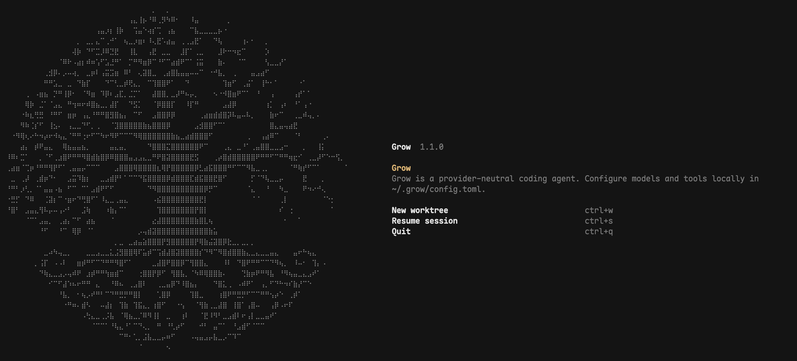

<p align="center">
  
</p>

# Grow

Grow 是一个从 xAI Grok Build 分叉并独立演进的终端 AI 编程 Agent。它保留了成熟的 Rust
TUI、Agent runtime、工具系统和 ACP 接口，但模型、认证、Agent 协作、权限和发布链已经收敛到
Grow 自己的边界。

Grow 不是 xAI 官方产品，也不会内置 Grok 模型、推理端点或产品凭据。所有模型都由用户通过
BYOK 配置接入；会话、诊断和工作区状态默认保存在本地。

当前源码版本为 `1.1.0`。完整配置参考 [config.example.toml](config.example.toml)，分主题文档见
[Grow User Guide](crates/codegen/pager/docs/user-guide/README.md)。

## Fork 之后改了什么

这里不按内部 commit 罗列，直接看会影响使用方式的变化。

| 领域 | Grow 当前行为 |
| --- | --- |
| 模型 | 不提供内置模型目录。用户显式配置 Provider、模型和默认模型，支持 Chat Completions、Responses、Messages 三类后端。 |
| 认证 | 只接受用户自己的 API key、环境变量或本地密钥 helper；没有 OAuth/OIDC、设备登录和全局产品登录态。 |
| Agent | Agent 是平级 Markdown 定义，不绑定 Provider、模型或权限；同一份定义既可以作为主 Agent，也可以被当作子 Agent 调用。 |
| 交互模式 | Agent Role、Behavior 和 Permission 是三条独立轴。换 Plan/Goal 不会暗中换 Agent，换 Agent 也不会改变权限。 |
| 稳定性 | 支持截断续写、context overflow 自动压缩恢复、子进程树回收、leader 重连交互恢复，以及权限提示强制超时。 |
| 扩展 | 支持项目/用户级 Agent、Skill、MCP、Hook、Plugin 和可替换 Marketplace；Web Search 通过用户配置的 MCP 提供。 |
| 数据与网络 | 删除遥测上传、计费订阅、远程会话同步、托管搜索、远程公告和媒体生成等产品服务链。模型请求只访问当前 Provider。 |
| 分发 | GitHub Release 是唯一官方二进制渠道，产物内嵌固定版本 `rg`，覆盖 macOS、GNU/musl Linux 与 Windows 的 x86_64/arm64，并额外提供 Linux riscv64。 |

### 1.1.0 重点

- 权限弹窗不会再因为 pager、gateway 或 leader 丢包永久挂起。交互会话默认等待 60 秒，非交互
  会话默认等待 10 秒；超时后取消当前 turn，工具不执行，迟到的 Allow 无效。
- BYOK 认证边界进一步收紧：移除遗留 OAuth、外部 session 扫描和 vendor-specific tool mode，
  配置与恢复只围绕 Grow 本地 session 工作；密钥 helper 返回裸 JWT 时会按 `exp` 正确刷新。
- Agent Role、Behavior、Permission 和子 Agent 工具范围完成拆分，TUI 中通过同一套 selector
  切换，不再依赖隐藏的产品 mode。
- 合入与本地架构兼容的上游稳定性改进，包括进程树回收、截断/溢出恢复、终端兼容、后台任务与
  session 生命周期修复。
- Release 扩展为九个目标：macOS、GNU/musl Linux 与 Windows 的 x86_64/arm64，加 Linux
  riscv64；只有整组资产全部验证后才公开 Release。

版本级变更见 [1.1.0 release notes](crates/codegen/shell/changelogs/1.1.0.md)。

## 安装

### 下载 Release 二进制

[GitHub Releases](https://github.com/LordCasser/grow/releases) 提供以下资产。每个压缩包只包含一个
可执行文件：Unix 为 `grow`，Windows 为 `grow.exe`。

| 平台 | Release 资产 |
| --- | --- |
| macOS Apple Silicon | `grow-1.1.0-macos-aarch64.tar.gz` |
| macOS Intel | `grow-1.1.0-macos-x86_64.tar.gz` |
| Linux x86_64 | `grow-1.1.0-linux-x86_64.tar.gz` |
| Linux arm64 | `grow-1.1.0-linux-aarch64.tar.gz` |
| Linux riscv64 | `grow-1.1.0-linux-riscv64.tar.gz` |
| Linux x86_64（musl） | `grow-1.1.0-linux-x86_64-musl.tar.gz` |
| Linux arm64（musl） | `grow-1.1.0-linux-aarch64-musl.tar.gz` |
| Windows x86_64 | `grow-1.1.0-windows-x86_64.tar.gz` |
| Windows arm64 | `grow-1.1.0-windows-aarch64.tar.gz` |

选择对应资产后安装：

```sh
GROW_VERSION=1.1.0
GROW_ASSET="grow-${GROW_VERSION}-macos-aarch64.tar.gz" # 按上表替换

curl -fLO "https://github.com/LordCasser/grow/releases/download/v${GROW_VERSION}/${GROW_ASSET}"
tar -xzf "$GROW_ASSET"
mkdir -p "$HOME/.local/bin"
install -m 0755 grow "$HOME/.local/bin/grow"
grow --version
```

Windows PowerShell：

```powershell
$GrowVersion = "1.1.0"
$GrowAsset = "grow-$GrowVersion-windows-x86_64.tar.gz" # arm64 时替换资产名

Invoke-WebRequest `
  "https://github.com/LordCasser/grow/releases/download/v$GrowVersion/$GrowAsset" `
  -OutFile $GrowAsset
tar -xzf $GrowAsset
New-Item -ItemType Directory -Force "$HOME\bin" | Out-Null
Move-Item -Force grow.exe "$HOME\bin\grow.exe"
& "$HOME\bin\grow.exe" --version
```

Grow 当前不发布 npm、Homebrew 或其他包管理器版本。若所选安装目录不在 `PATH` 中，需要先按
当前 shell 的方式加入。

### 从源码安装

源码构建方式见本文后面的[编译与构建](#编译与构建)。

## 第一次启动

Grow 不会猜测模型。第一次启动前，在 `~/.grow/config.toml` 中至少配置一个 Provider、一个模型
和 `[models].default`：

```toml
[models]
default = "deepseek/deepseek-chat"
output_limit = 65536

[provider.deepseek]
api_backend = "chat_completions"

[provider.deepseek.options]
base_url = "https://api.deepseek.com/v1"
env_key = "DEEPSEEK_API_KEY"

[provider.deepseek.models.deepseek-chat]
name = "DeepSeek Chat"
context_window = 128000
output_limit = 65536
reasoning_efforts = ["high", "max"]
```

然后设置环境变量并启动：

```sh
export DEEPSEEK_API_KEY="your-key"
grow
```

`api_backend` 描述 API 协议，不描述厂商：

- `chat_completions`：请求 `/v1/chat/completions`
- `responses`：请求 `/v1/responses`
- `messages`：使用 Messages-compatible 请求格式

凭据也可以通过 `api_key` 直接写入配置，或通过 `[auth_provider.<id>]` 调用本地密钥 helper。
推荐使用 `env_key`；Grow 不管理 refresh token，也不会打开浏览器登录。

完整模型、思考强度和本地 Ollama/OpenAI-compatible 示例见
[LLM Providers and BYOK](crates/codegen/pager/docs/user-guide/11-custom-models.md)。

## 日常使用

### 常用启动方式

```sh
# 打开交互式 TUI
grow

# 新 session 启动后立即发送任务
grow "修复失败测试并运行相关用例"

# 在指定项目目录启动
grow --cwd ~/projects/my-app

# 为任务创建 git worktree；名称和值之间建议使用等号
grow --worktree=feature "实现新功能"

# 继续最近一次 session，或恢复指定 session
grow -c
grow --resume <session-id>

# 使用已经配置的模型
grow -m deepseek/deepseek-chat

# 非交互执行，适合脚本和 CI
grow -p "检查当前仓库并输出 JSON 风格结论"
```

Headless 输出格式、stdin 和退出码见
[Headless Mode](crates/codegen/pager/docs/user-guide/14-headless-mode.md)。ACP stdio/WebSocket 集成见
[Agent Mode](crates/codegen/pager/docs/user-guide/15-agent-mode.md)。

### TUI 中最常用的入口

`Ctrl+X` 是会话 selector 的前导键：

| 按键 | 作用 |
| --- | --- |
| `Ctrl+X`，然后 `M` | 切换当前 session 的模型 |
| `Ctrl+X`，然后 `A` | 切换当前主 Agent |
| `Ctrl+X`，然后 `E` | 切换当前模型的 reasoning effort |
| `Ctrl+X`，然后 `P` | 切换 Ask / Auto / Always Approve |
| `Ctrl+X`，然后 `B` | 切换 Normal / Clarify / Plan / Static Workflow / Deep Research / Goal |
| `Ctrl+R` | 重做输入框中的上一次撤销 |

同样可以使用 `/model`、`/agent`、`/effort`、`/permission` 和 `/behavior`。`/agents` 打开
Agent Dashboard，`/resume` 恢复 session，`/compact` 主动压缩上下文。

完整快捷键和命令见 [Keyboard Shortcuts](crates/codegen/pager/docs/user-guide/03-keyboard-shortcuts.md)
与 [Slash Commands](crates/codegen/pager/docs/user-guide/04-slash-commands.md)。

## 核心配置

Grow 的用户配置位于 `~/.grow/config.toml`。项目级 `.grow/config.toml` 只用于 MCP、Plugin、
Permission 规则和 MCP 输出限制，避免项目文件覆盖个人模型、UI 或认证配置。

### 模型与输出边界

```toml
[models]
default = "provider/model"
default_reasoning_effort = "high"
output_limit = 65536
inference_idle_timeout_secs = 300
max_retries = 3
```

- `context_window` 用于本地上下文预算和自动压缩。
- `output_limit` 控制单次模型输出上限，模型级值优先于 `[models]`。
- `inference_idle_timeout_secs` 是流式 chunk 之间的空闲超时，不是整个 turn 的总时限。
- `reasoning_efforts` 只应声明 Provider API 实际支持的值，Grow 不会替模型猜能力。

### Permission、超时与 Sandbox

```toml
[ui]
permission_mode = "ask" # ask | auto | always-approve

[session]
permission_prompt_timeout_secs = 60
non_interactive_permission_prompt_timeout_secs = 10

[sandbox]
profile = "workspace" # off | workspace | devbox | read-only | strict

[permission]
allow = ["Bash(git status*)", "Bash(git diff*)"]
ask = ["Edit(**)"]
deny = ["Bash(rm -rf *)"]
```

两个 permission timeout 都必须是正整数，`0` 是配置错误。它们只约束真正等待用户回答的提示；
策略直接允许/拒绝、YOLO 和 auto-classifier 不受影响。超时会以 `permission_timed_out` 取消当前
turn，不执行工具，也不会持久化迟到的授权。

Permission 匹配、企业受管规则和 Always Approve 锁定见
[Permissions and Safety](crates/codegen/pager/docs/user-guide/22-permissions-and-safety.md)。

### Agent、Skill 与子 Agent

Agent 定义从以下目录发现：

```text
<project>/.grow/agents/   # 项目级，优先
~/.grow/agents/           # 用户级
<project>/.grow/skills/
~/.grow/skills/
```

最小 Agent 定义：

```markdown
---
description: Review code without modifying it
tools:
  - read_file
  - grep
  - list_dir
---

Report concrete findings with file locations.
```

Agent Markdown 不接受 Provider、模型、Behavior 或 Permission 字段。这些都是 session 运行状态。
子 Agent 是否启用由 `[subagents]`、`[subagents.toggle]` 和主 Agent 的 `Agent(...)` 工具范围共同
决定。详细规则见 [Agent README](crates/codegen/agent/README.md)、
[Subagents](crates/codegen/pager/docs/user-guide/16-subagents.md) 与
[Skills](crates/codegen/pager/docs/user-guide/08-skills.md)。

### MCP、Web Search 与自动更新

Grow 不内置 Web Search Provider。需要联网搜索时配置一个提供搜索工具的 MCP Server：

```toml
[mcp_servers.web-search]
command = "/absolute/path/to/search-mcp-server"
args = []
env = { SEARCH_API_KEY = "${SEARCH_API_KEY}" }
enabled = true
```

MCP 可以使用 stdio 或 streamable HTTP。详细字段见
[MCP Servers](crates/codegen/pager/docs/user-guide/07-mcp-servers.md)。

自动更新默认关闭，只读取 `LordCasser/grow` 的 GitHub Releases：

```toml
[cli]
auto_update = true
```

## 本地数据与网络边界

- 用户目录：`~/.grow/`，可通过 `GROW_HOME` 改写。
- Session：默认保存在 `~/.grow/sessions/`，已有 session 恢复上次使用的 Agent、模型和 effort。
- 项目规则：按目录发现 `AGENTS.md`；项目资源使用 `.grow/`。
- 诊断：只写本地日志，不包含遥测、Sentry、OTLP exporter 或 trace upload。
- 网络：模型请求访问当前 Provider；MCP、Plugin/Marketplace 和 auto-update 只在用户配置后访问。

本地诊断格式见 [Local Diagnostics](crates/codegen/pager/docs/user-guide/24-monitoring-usage.md)。

## 编译与构建

### 环境

- Git
- [Rustup](https://rustup.rs/)；仓库的 `rust-toolchain.toml` 固定 Rust 工具链
- C/C++ 基础构建工具；Linux release 环境还需要 `make`、`cmake`、`perl`、`pkgconf`
- [ripgrep](https://github.com/BurntSushi/ripgrep)；普通源码构建使用 `PATH` 中的 `rg`

### 开发与本机 release build

```sh
git clone https://github.com/LordCasser/grow.git
cd grow

cargo check --locked -p cli
cargo test --locked -p workspace --lib
cargo test --locked -p shell --lib -- --test-threads=4
cargo test --locked -p pager --lib
cargo build --locked --release -p cli --bin grow
./target/release/grow --version
```

本机产物位于 `target/release/grow`。普通 Cargo build 不会联网下载 `rg`；没有嵌入 sidecar 时，
运行时从 `PATH` 查找。

### 构建自包含分发二进制

官方资产使用 `release-dist` profile，并在构建时显式嵌入目标平台的 `rg`：

```sh
GROW_TOOLS_BUNDLE_RG_PATH="$(command -v rg)" \
  cargo build --locked --profile release-dist -p cli --bin grow

./target/release-dist/grow --version
```

交叉编译时必须提供目标平台可执行的 `rg`，不能把宿主机二进制嵌入其他架构。官方 workflow 会
校验下载的 `rg` SHA-256、按目标平台构建并检查最终压缩包结构。

`.cargo/config.toml` 已覆盖以下官方目标；源码构建可把 `<target>` 换成对应 triple：

```text
x86_64-apple-darwin             aarch64-apple-darwin
x86_64-unknown-linux-gnu        aarch64-unknown-linux-gnu
x86_64-unknown-linux-musl       aarch64-unknown-linux-musl
x86_64-pc-windows-msvc          aarch64-pc-windows-msvc
```

```sh
cargo build --locked --release -p cli --bin grow --target <target>
```

Release workflow 另外构建 `riscv64gc-unknown-linux-gnu`。GNU 资产以 glibc 2.28 为最低基线，
musl 与 riscv64 通过 `cross` 构建；Windows 使用静态 CRT。

## 1.1.0 发布准备

Grow 的可发布应用 crate 继承根 workspace 版本；部分内部 leaf crate 仍保持自己的 `0.1.0`
版本。tag 必须与 `cli` / workspace 版本一致。

发布前至少执行：

```sh
cargo metadata --locked --no-deps --format-version 1 \
  | jq -r '.packages[] | select(.name == "cli") | .version'

cargo fmt --all -- --check
cargo check --locked -p workspace -p shell -p pager -p cli
cargo test --locked -p workspace --lib
cargo test --locked -p shell --lib -- --test-threads=4
cargo test --locked -p pager --lib
cargo test --locked -p shell --test test_mcp_permission_persistence

GROW_VERSION=1.1.0 GROW_TOOLS_BUNDLE_RG_PATH="$(command -v rg)" \
  cargo build --locked --profile release-dist -p cli --bin grow
./target/release-dist/grow --version
```

release commit 完成且工作区干净后，可以用 `scripts/act-release.sh validate` 在本地校验 tag/version
契约；脚本会在缺少 `v1.1.0` 时只创建本地 tag，不会推送。

正式发布流程：

1. 提交版本、lockfile、release notes 和文档。
2. 创建并推送 annotated tag `v1.1.0`，不要提前创建公开 Release。
3. [release workflow](.github/workflows/release.yml) 通过 matrix 构建九个目标，并嵌入固定版本
   `rg`。
4. workflow 先创建隐藏 draft Release，验证九个 updater 约定资产均已上传后再一次性公开。

Release 页面只包含九个最终 `.tar.gz`，不会公开构建中间物或单独 checksum 资产。稳定版与带
SemVer 预发布段的版本分别进入 stable / prerelease 更新通道。

## 文档与源码边界

- [完整配置](config.example.toml)
- [用户指南](crates/codegen/pager/docs/user-guide/README.md)
- [Prompt Architecture](crates/codegen/agent/PROMPT_ARCHITECTURE.md)
- [Agent 定义](crates/codegen/agent/README.md)
- [Session 与恢复](crates/codegen/pager/docs/user-guide/17-sessions.md)
- [Sandbox](crates/codegen/pager/docs/user-guide/18-sandbox.md)

CLI composition root 位于 `crates/codegen/cli`，TUI 位于 `pager`，Agent/session runtime 位于
`shell`，工作区与权限位于 `workspace`，工具实现位于 `tools`。更细的依赖边界以各模块源码和
架构文档为准，不在 README 重复。

## 来源与许可证

Grow 基于 xAI Grok Build 的开源代码分叉。上游名称只保留在来源说明、许可证和历史
changelog 中。

第一方代码使用 Apache License 2.0，见 [LICENSE](LICENSE)。第三方与 vendored 代码沿用各自
许可证，见 [THIRD-PARTY-NOTICES](THIRD-PARTY-NOTICES) 和
[third_party/NOTICE](third_party/NOTICE)。
