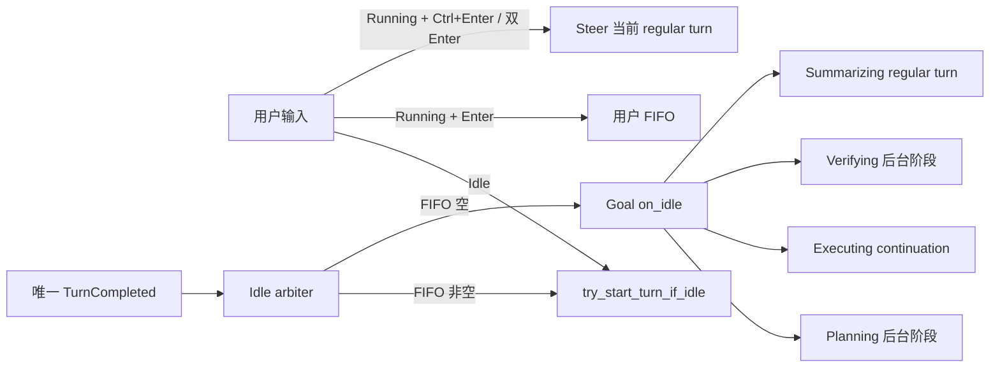

# Grow 会话、Turn 与 Behavior 架构

本文描述重构后的权威管线。核心原则只有两个：前台执行只有一个 owner；所有新工作都从同一个 idle gate 进入。Goal 的 planner/verifier 是后台阶段，不是伪装成 turn 的第二套调度器。

## 1. 权威状态

Shell actor 是执行权威，Pager 只是按结构化通知绘制镜像。

```rust
enum ForegroundState {
    Idle,
    RegularTurn(AgentTask),
    Compaction,
}
```

`ForegroundState` 是唯一前台 owner。Goal planner/verifier、watcher 和后台 task 不占 foreground。`current_prompt_id` 等字段只用于关联或显示，不能反推忙闲状态。

每个 regular turn 都显式携带：

- `prompt_id`：turn/message 的稳定身份；
- `PromptOrigin`：User、GoalContinuation、GoalFinalization、TaskCompleted 等来源；
- `TurnKind`：User 或 Internal；
- 一个 completion owner，只能提交一次 durable `TurnCompleted`。

不再通过 prompt-id 前缀、trim 后的文本、零 token 或 Goal status 猜测 origin、owner 和终态。

## 2. 统一调度



完成顺序固定：

1. 核对并结算当前 `ForegroundState::RegularTurn` 的 exact owner；
2. 持久化这个 turn 唯一的 `TurnCompleted`；
3. 提升用户 FIFO；
4. 仍然 idle 时才运行 Goal idle hook。

因此用户消息与 Goal continuation 同时就绪时，用户永远先运行。Goal continuation 不进入用户 FIFO，也没有 synthetic prompt hot loop。

## 3. 输入命令

Shell 命令面只保留两个明确动作：

- `QueuePrompt`：将普通 Enter 加入显式 FIFO；
- `SteerQueuedPrompt { expected_turn_id, ... }`：把一个已排队的用户消息原子转入指定的当前 turn。

Pager 语义：

| 输入 | Idle | Regular turn 正在运行 |
|---|---|---|
| Enter | 启动/提交 turn | 加入 FIFO |
| Ctrl+Enter | 无活动 turn，拒绝 | steer 同一个 turn |
| 双 Enter | 不适用 | 将刚排队的首项原子转换为 steer |
| queue row “Send now” | 不适用 | 调用同一个 steer 命令 |

Steer 是软中断采样并把补充消息注入同一个 user-visible turn。它不创建第二个 terminal，不切换 Behavior，也不推进 Goal revision。`expected_turn_id` 让延迟到达的 UI 操作无法误伤后来的 turn。

## 4. Behavior 与 Goal 的边界

通用 `BehaviorController` 继续管理 Normal、Clarify、Plan、Workflow、DeepResearch 等协作模式。Goal 对用户仍是 `BehaviorId::Goal`，但其生命周期状态由独立 `GoalTracker` 管理。

- `/goal` 与 Behavior picker 共用同一个同步 control-plane handler；
- Goal 未完成且未 clear 时，拒绝切换到其他 Behavior；
- pause 仍显示 Goal Behavior；complete 或 clear 后回到 Normal；
- control handler 只改状态并返回，绝不运行模型、等待 stage 或排 hidden prompt；
- 普通补充消息属于当前 Goal 上下文，但不会自动修改 objective/plan revision；只有 `/goal edit` 修改 objective。
- live tool bridge 缺少任一 Goal 工具时 fail closed 为 Paused，不允许 idle hook 自治；
- Goal stage 与 Goal turn 创建的 subagent 在 producer 侧携带 `goal_id`，预算归属不读取事件到达时的当前状态。
- Goal 故障归属同样读取 regular turn 的结构化 origin；仅仅“当前选中 Goal Behavior”不能把普通用户 turn 的 API 错误归因给 Goal。

Goal 的详细状态机见 [goal-continuation.md](./goal-continuation.md)。

### 4.1 中断与切换矩阵

| 当前状态 | 用户动作 | 结果 |
|---|---|---|
| 任意 regular turn | Enter | 只进入 FIFO；不改变当前 Behavior |
| 任意 regular turn | Ctrl+Enter / 双 Enter / prompt queue row “Send now” | 用 `expected_turn_id` steer 当前 turn；不产生新 terminal |
| 任意 regular turn | Esc / Ctrl+C / Stop Turn Only | 只取消 foreground；Goal 仍 Active，idle arbiter 先提升 FIFO，再决定是否继续 Goal |
| Active Goal | Goal interrupt panel 的 Pause | 取消 foreground、使 stage lease 失效并进入 Paused；Behavior 仍为 Goal |
| Active/Paused/Blocked Goal | 切换到其他 Behavior | 拒绝；只有 verified completion 或 `/goal clear` 能离开 Goal |
| Active/Paused/Blocked Goal | `/goal edit` | 推进 objective revision、清除旧验证证据、回到 Active/Planning；普通补充消息不做这些事 |
| 非 Goal Behavior、无未完成 Goal | `/goal set <objective>` | 切换到 Goal 并创建 objective；这是 `set` 唯一有效的用户入口 |
| Goal Behavior、尚无 objective | 普通用户消息 | Shell 直接捕获为 objective；Pager 不生成 hidden `/goal set` |
| Goal Behavior、已有未完成 Goal | `/goal set` | 拒绝并提示使用 `/goal edit`；补全列表隐藏 `set`、预填 `edit` 的当前 objective |
| Active Goal / Verifying | `update_goal_plan` 成功 | 推进 plan revision、终止匹配 verifier、清除旧候选并回到 Executing；Goal Behavior 不变 |
| Plan 或运行中的 Deep Research | 第一次切换 | 进入 8 秒确认窗，不改变状态 |
| Plan 或运行中的 Deep Research | 确认窗内再次选择同一目标 | 取消该 Behavior 拥有的工作，再应用目标 Behavior |
| Normal / Clarify / static Workflow | Behavior 切换 | 更新后续 turn 的 Behavior；已开始的 turn 继续使用其捕获的 prompt mode/tool surface |
| 任意 Behavior | 模型切换、后台 task 完成、synthetic wake | 不解释为 Behavior 切换，也不能确认一个 parked switch |

regular turn 在开始时捕获 `PromptMode`。即使 picker 在它运行期间改变了 session Behavior，tool-definition snapshot、verbatim fork 与该 turn 后续采样仍使用捕获值；新 Behavior 只从下一 foreground owner 生效。这样不会出现 Normal turn 中途暴露 Goal 工具、或 Plan turn 中途丢失 Plan 工具的跨 turn 污染。

## 5. Pager 对账

Pager 不再使用 `skip_next_user_echo`、文本 trim 匹配或 running-adoption stash。所有 optimistic user bubble 与 ACP echo 通过 `messageId` 对账：

- 相同 `messageId` 只保留一个气泡；
- echo 可补写 `promptIndex` 等服务端元数据；
- 重放和乱序重复是幂等的；
- `QueueChanged.runningPromptId/origin/turnKind` 只镜像 shell 已确认的 foreground。
- session reload 通过 `grow/foreground = { promptId, origin, turnKind, turnStartMs }` 恢复 regular foreground；缺字段即视为没有可接管的 foreground，不再接受只含 prompt id 的旧协议。

Goal Planning/Verifying 只更新 Goal chip，不把 Pager session 伪装成 Running，用户仍可提交或 steer 真正的 regular turn。

Goal detail 中的 blackboard 是 `GoalPlan.markdown` 的只读 Markdown 投影；运行时的 Agent-only 指令不通过 `GoalUpdated` 发送，也不在看板上展示。Markdown parse/wrap 缓存属于 Pager view state，session reload 后可重建，不能反向修改 Goal。

## 6. 动画与忙状态

Pager 使用只读 `AgentActivityProjection` 统一投影 foreground turn、Active Goal 后台阶段、watcher/bg task、workflow、subagent 和 needs-input；Agent 页、Dashboard、状态栏、terminal title 与可见动画 demand 共用这份投影。

- parked 只改变展示，不能把仍在执行的 foreground 伪装为 idle；
- 每次 draw 只捕获一个 `FrameStamp`，所有 spinner、wave、Goal 计时与 title 使用同一单调时间样本；
- FPS 只限制重绘频率，动画周期不随 FPS 或 ACP event 数量变化；
- animation、UI expiry、prompt watchdog、scroll 与真正模拟器的 simulation clock 相互独立；watchdog 不再借动画 frame 获得运行机会；
- ACP token firehose 每次只 drain 有界 batch，并在每个 batch 前领取到期 deadline，因此动画最多再等一个 batch；
- 隐藏页面和静态 idle 页面不请求 frame，恢复可见时按当前时间直接追上相位。
- 搜索、inline media、edit 高亮与 Mermaid 完成走独立 async-view completion edge，Tracing
  使用自己的 channel arm；它们都不占用 animation 或 UI expiry clock。Goal/session reload
  不持久化 worker、mailbox 或 frame state。

具体契约见 [pager-motion.md](./pager-motion.md)。

## 7. 必须保持的不变量

1. 同一时刻至多一个 foreground owner。
2. planner/verifier 永远不占 foreground。
3. 一个 regular turn 恰好一个 durable terminal。
4. 用户 FIFO 总是在 Goal idle continuation 之前提升。
5. steer 只修改当前 turn，不产生新 turn。
6. identity、origin、kind 都来自结构化字段，不从文本或 ID 格式推断。
7. Pager 每个 `messageId` 至多一个用户气泡。
8. pause/clear 使相应 Goal stage lease 失效；异常退出不能永久卡住 latch。
9. Goal 状态不能作为通知 ownership；只抑制明确归属于 Goal turn 的 task id。
10. 成功改变 Goal 定义/生命周期的控制会取消旧上下文 turn，被拒绝的控制不会。
