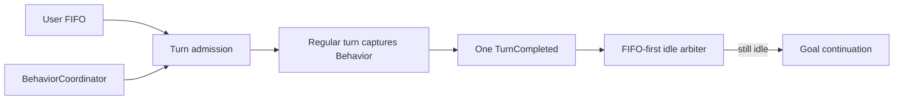

# Grow Turn、Behavior 与 Runtime 架构

Shell actor 是执行与控制权威，Pager 只消费结构化投影。核心不变量是：一个 foreground owner、一个用户 FIFO、一个 Behavior identity、一个原子 control snapshot。

## Turn admission

```rust
enum ForegroundState {
    Idle,
    RegularTurn(AgentTask),
    Settling { prompt_id: String },
    Compaction,
}
```

`InputItem` 只保存 message id、内容、origin 与 turn kind，不保存 Behavior。消息真正获得 foreground 时捕获当前 `BehaviorId`；该 turn 的 prompt、工具面和限制随后保持不变。用户 picker 的 Behavior transition 与 foreground admission 共享 session state mutex，只允许在 `Idle` 提交；Goal lifecycle 工具可以在已 admission 的 turn 内原子提交下一状态，但不会重标当前 turn，也不会把新协议插进已经运行的因果单元。唯一的控制面例外是 Normal/Clarify foreground 中的 out-of-band `/goal`：它先持久化 Goal Behavior，再由命令平面取消原 exact foreground；Plan/Workflow 冲突和 picker 的 idle gate 均不放宽。

Behavior 协议不再拼进或替换 system head。Timeline `control` 事件把权威选择与一个 `<behavior-context>` synthetic user 项原子提交。Idle transition 立即进入 Surface；Goal 完成、Plan 结束等 turn 内 transition 先留在 Timeline fold 的 pending slot，durable `TurnEnded` 后只激活最后一个，因此不会插进 tool call/result，也不会排在旧 Behavior 所产生的迟到输出之前。下一次请求沿原位置重放，provider-visible 前缀保持 append-only。切回 Normal 会物化明确的 reset，较早的特殊协议只保留为因果历史，不再处于活跃状态。

完成顺序固定为：runner 返回后把 exact foreground owner 转入 `Settling` → 确认 Timeline turn terminal 与唯一 `TurnCompleted` 已持久化 → 释放 foreground fence → 提升用户 FIFO → 若仍 idle 再运行专用 runtime hook。`Settling` 仍然是 foreground ownership，Goal continuation 不进入 FIFO，synthetic work必须携带结构化 origin/lease，因此首条 Goal objective 的外层 user turn 不可能被 continuation 的 `TurnStarted` 越过。

普通采样的 `prompt_cache_key` 由 Timeline identity、最新 rewind 分支锚点和完整 model route（backend/base URL/model）派生。普通 append、Behavior 切换和 Agent 选择不改变血统键；fork、rewind 与 model route 切换改变。血统键只负责 provider 粘性路由，不能替代 provider-visible 前缀相等校验。

Session 的 catalog identity、provider sampler config、reasoning effort 与 transport 由 actor 作为一个带 revision 的 `SessionModelRoute` 提交。SessionHandle、模型菜单、subagent spawn 和 catalog reload 都只读取该原子快照，不能分别读取 handle ID 与 ChatState route 后拼接。catalog reload 在全局 publication 临界区构造并发布一个 catalog generation，再把同一代快照排入每个 session mailbox；随后立即释放全局锁，不能让一个 busy session 的 acknowledgement 阻塞其他 prompt 或模型操作。actor mailbox 顺序是 session route 的唯一提交顺序：busy foreground 只保留最新 reload 快照但挂接全部 responder，在下一 idle boundary 先应用它，再允许 prompt、notification 或 Goal。这里不再叠加一套 expected-route-revision/stale 协议；只有仍属当前 catalog generation 的真实应用失败才驱逐 session。



输入语义见 [input-routing.md](./input-routing.md)。

## 唯一 Behavior identity

`tool_types::BehaviorId` 是 Shell、Tools 与 Pager 的唯一身份：`Normal | Clarify | Plan | Workflow | Goal`。代码内部不再保留第二套 Behavior identity；ACP 的 `SessionModeId` 只是外部传输字段名。Pager 的 `PromptMode` 仅表示输入框是否正在编辑排队消息，与 Behavior 无关。

`BehaviorCoordinator` 是纯决策器：输入当前选择与 `BehaviorSwitchFacts`，输出 `Applied | ConfirmationRequired | Rejected` 及 declarative effects。它不运行模型、不等待子 Agent、不写文件、不触碰 Pager。SessionActor 串行执行 effect，并在取消 owned work 之前先持久化目标 control snapshot。

Plan 与 Goal 各自保留必要的专用状态。Workflow Definition/Run 统一走 Workflow Workspace 与 manager，不再按用途派生私有 runtime。

## Behavior 语义

| Behavior | foreground 对话 | 工具/权限 | owned work 与切换 |
|---|---|---|---|
| Normal | 标准 regular turn | 普通 Agent 权限 | 可立即切换 |
| Clarify | 对抗性问答，逼近目标与决策 | 不额外限制；副作用仍走普通权限 | 无 runtime，可立即切换 |
| Plan | Drafting/Awaiting/Amending 只规划；Executing 执行批准计划 | 非 Executing 拒绝 workspace mutation；Executing 恢复普通权限 | 离开未结束 Plan 需同目标二次确认并取消 Plan-owned foreground |
| Workflow | 主 Agent正常对话与整合 | 普通权限与 Workflow tool | Behavior 是公共 Definition/Run 管理的唯一入口，但不拥有已启动 Run 的生命周期 |
| Goal | Active 时正常对话并在 idle 后继续；stopped Goal 只是持久目标记录 | 主 Agent 获得 Goal scoped tools | 只有 Active Goal 选择 Goal Behavior；pause/block/budget limit 释放为 Normal，restart 再激活 |

Plan 的 artifact revision/hash 与 phase 存在 control snapshot；Plan 文档是 Plan Behavior 的审批产物，不是 Goal 黑板。Workflow Workspace 持久化 session 草稿与 Definition 焦点，Run 属于统一公共 runtime。`deep-research` 由 builtin extractor version-managed 到 `~/.grow/workflows/deep-research.rhai`，作为普通 User workflow 由 Registry 扫描，不拥有额外 scope、Behavior 或运行机制。

## 切换矩阵

| 状态/动作 | 结果 |
|---|---|
| 相同 Behavior 重选 | 幂等 Applied，并清 pending confirmation |
| 普通 Behavior 切换 | 只影响之后 admission；当前 turn 保持捕获的 Behavior |
| Active Goal → 非 Goal | 先显式 pause/complete/clear；Goal lifecycle 与 Behavior 原子提交 |
| stopped Goal + 任意 Behavior | 允许；Goal 记录与当前 Behavior 正交 |
| Plan → 其他、且 Plan 未结束 | 第一次进入 8 秒确认窗；同一 source/target 再选才应用 |
| public Workflow active → Plan/Goal | 拒绝 |
| Plan/Active Goal 内启动或恢复 Workflow | 拒绝；pause/stop/save 等管理操作仍可用 |
| completed Goal receipt + 任意 Behavior 切换 | receipt 保留；只有显式 `/goal clear` 删除它 |
| 模型切换、stage terminal、synthetic wake | 不能确认或清除 pending user switch |

确认窗是 transient 用户交互状态，不持久化。只有用户的 mode selection/明确 slash control会调用该路径；runtime completion 不通过它“顺手切模式”。

Plan/Goal lifecycle 工具是采样批次的状态屏障。一个 provider batch 只要包含
`PlanControl` 或 Goal lifecycle update，就只执行按 provider 顺序出现的第一个控制调用；
同批其他读写、执行和后续控制调用全部通过统一 cancellation/result 路径闭合，然后重新采样。
因此控制调用之前或之后都不存在可以越过新 phase/Goal definition 的普通副作用。

## Agent 权限交集

工具必须同时满足：

`registered exact identity ∩ Agent hard eligibility ∩ Behavior policy ∩ projected RWX ∩ call permission ∩ one-shot permit`

每个注册工具只在 descriptor 声明一次 RWX 上界，`ToolKind` 只负责展示与检索，不能参与授权。冻结参数经唯一 call projector 得到本次所需 RWX，并证明它不超过 descriptor 上界；未知 descriptor、未知动态输入和未知 MCP trust domain 都按 `All` fail closed。permission mode 只决定一个已允许副作用是否需要批准，不能授予 capability。Behavior policy按 admission 捕获的 Behavior约束调用，因此运行中的 Normal turn不会因 picker 切到 Goal突然获得 Goal工具，Plan turn也不会中途失去 edit gate。

Workflow Definition 使用同一 Agent capability、MCP binding 与 PermissionManager 交集；`deep-research` 不获得额外的 Behavior 级权限。Goal role/object 权限见 [goal-continuation.md](./goal-continuation.md)。

`SubagentCapabilityState` 是子 Agent 唯一的 hard eligibility 与初始 RWX 事实源。Agent authored snapshot 以精确 wire tool identity 定义 hard ceiling，delegated mode 是不可变初始 RWX；未声明时统一取 `ReadWrite`。工具 schema 始终稳定，catalog 标出 available/locked/forbidden：初始 RWX 内的调用沿用普通快速路径，RWX 外但 hard-eligible 的精确调用直接进入 Ask/Auto，hard ceiling 外则在提示前拒绝。允许不会修改 session authority，而是只签发一次性 permit，绑定 actor epoch、call id、真实 target、canonical args、cwd、projected RWX 与 MCP generation，公共 dispatch 边界消费前重验。每个 child handle 另持不可变 `DelegableCapabilityCeiling`：nested child 在创建资源前将请求 mode 与 immediate parent 初始 mode 做偏序交（`ReadWrite ∩ Execute = ReadOnly`），且只能继承 ceiling 中同一 transport ID 的 MCP binding；父会话的审批历史永不扩大后代 ceiling。生命周期展示可以把 nested child 归并到根 Session，但 `SubagentSpawnEvent.security_parent_session_id` 永久记录直接安全父级；只有根 owner 或同一直接安全父级可以恢复该 child，兄弟 child 不共享恢复权限。

子 Agent 的 permission mode 只有 `Ask / Auto / AlwaysApprove`，在 child 创建时独立解析；主会话后续切换 mode 不广播给 child，内部缺失 child route 时按 `Auto` 收口而不是继承 primary live mode。子 Agent 的 locked exact-call Auto 裁决由 primary session 承担，但这是裁决执行位置，不是权限模式继承。未被权威规则直接解决的精确调用按 `[subagents].classifier_input` 创建临时判断分支：默认 `context` 从主 ChatState 当前压缩状态中只提取带 first-party `PermissionEvidence` 的真实用户任务/插话，排除 assistant、tool result、summary 与 synthetic user-role 内容，再追加结构化调用事实；`request_only` 只携带待裁决动作以节省 token。`PermissionEvidence` 在真实 ingress 铸造并随本 session 的 JSONL replay 原样恢复，缺失或未知值 fail closed，不能由 role 或 `promptIndex` 推导；fork 会保留历史文本但清除该证据，因为 child 是新的权限域，subagent 的权限只能来自 typed spawn capability ceiling。两个分支都禁用工具、使用主会话 active model，并只返回严格的 `{decision, reason}`；推理强度统一服从 `[auto_mode].reasoning_effort`，未配置时保持 unset，不继承主 turn 的高推理强度。Responses/Messages 使用 native JSON Schema，Chat Completions 使用跨 OpenAI-compatible provider 的 JSON Object wire contract 后做相同的本地严格校验。完整最大 attempt（包含输出 schema）先冻结 Sideband 预算；空响应、schema 错误、可恢复 API/transport error 和单次 attempt timeout 共用最多两次的有限尝试器，两次 attempt 共享一个总 deadline，不可恢复的 auth/request error 立即 fail closed。临时消息、原始模型结果和结构化裁决都不得写回 ChatState、memory、compaction、fork context 或普通 ConversationItem。`[auto_mode].classifier_model` 只服务主会话自身分类路径，不覆盖子 Agent 的主上下文裁决模型。

权限拒绝是子 Agent 的工具级结果，不是 turn 级终止：Auto deny/unavailable、人工 Reject/TimedOut 和 stale permit 都让当前工具 fail closed，并把可操作的失败结果交回下一次子模型采样；只有明确 Cancel、父任务终止或 session teardown 可以取消子 turn。最终 `PermissionEvent` 是审计事实源，经 primary session 的 audit bridge 持久化为 UI-only update。Pager 将同一主 Agent turn 内到达的事件保留在一个带 epoch 的稳定结构化权限块中；status、tool 等中间消息不会拆组，只有真实 `TurnCompleted` 推进 epoch 并封口。展开成员始终单行，双击成员读取完整 live 请求和 classifier reason；持久化 replay 只恢复脱敏安全摘要。该块不复用 tool-verb 分类或其设置，也不进入模型上下文。

## 原子 Timeline Control 事件

Timeline 的 `control` 事件包含单调 control revision，以及 Behavior snapshot、Plan phase/approval/artifact revision/hash 与 Goal state/receipt。它是唯一持久控制事实；不存在 control sidecar。

- 控制命令收到持久化 ack 后才返回 Applied/成功。
- 先持久化将要到达的控制状态，再取消 exact foreground/owned run并发布 UI projection。
- Goal finalization 的 Timeline turn identity 携带结构化 origin/turn kind/goal id/stage id，turn terminal携带 stop reason/completion kind；terminal与 Control事件共享同一有序 Timeline actor，确保 terminal先落盘，再写 Complete/Normal。若进程恰在两次写入之间退出，恢复器从 durable Timeline terminal对账并补写 Complete receipt，不读取 `updates.jsonl`，也不重复 final report。
- Plan 的 submit/approve/reject/abandon 都等待 control ack；持久化失败时恢复内存中的前一 Behavior snapshot，不向模型或 Pager 发布不可恢复的相位。
- Plan 恢复校验 artifact hash；Workflow Run 恢复只消费统一 Timeline lifecycle 与对应 snapshot。
- Goal 内部冲突 fail closed 为 Paused 并释放到 Normal；不支持的 architecture version 直接拒绝加载。
- Behavior 与 Goal 只通过 Timeline `control` 事件原子提交；不存在第二套控制状态读写路径。
- session fork 清除 Goal runtime ownership 并归一为 Normal；Workflow Run 不伪装成 Behavior 私有状态。

## Pager 与 motion

Shell 在 `AvailableCommandsUpdate.meta["grow/behaviorAvailability"]` 发布由 `BehaviorCoordinator` 同源生成的结构化选择快照；Pager 只用它显示支持性、临时不可用原因和需确认状态。真正切换仍由 Shell 对最新事实重新校验。连接初始化期间尚未收到该字段时，Pager 只以 Shell 同一消息中的命令/工具目录作短暂降级，不从本地 UI 或动画状态推断 runtime ownership。

Pager 同样只消费 Shell 发布的 foreground identity、Goal task projection和 `AgentActivityProjection`，不重复推断 owner。

optimistic user bubble 与 ACP echo只按 `messageId` 对账；不用 trim 文本、skip boolean或 adoption stash。Goal continuation、Workflow、watcher和 subagent wait都进入统一 activity projection。

所有 Workflow Run（包括 `deep-research`）只消费同一 `WorkflowUpdated` 投影，并统一出现在 transcript、tasks pane、activity、`/workflows` 与 `/workflow-run` 管理面。不存在 `private_workflow_runs` 或第二套终态投影。

child 会话的 `ask_user_question` 提问所有权留在 child 视图（兄弟 child 提问互相独立，不 hoist 到父视图），主界面通过父视图 turn-status ◆ 等待指示与 dashboard `NeedsInput`（顶层行与子代理行）立即呈现，回答走 child 全屏（subagent 提问不在 dashboard peek 提供作答；root 自己的提问仍可在顶层行 peek 中作答）。

spinner、wave、timer、title和任务符号只消费同一 draw的 `FrameStamp`。animation deadline、UI expiry、lifecycle watchdog和scroll deadline互不短路；详见 [pager-motion.md](./pager-motion.md)。

## 静态禁止项

- 队列携带/重标 Behavior；
- prompt-id前缀或 token/status组合推断 origin；
- hidden Goal turn、GoalSummary/GoalControl/GoalClassifierNudge；
- Pager文本 echo/adoption协议；
- view tick counter或render修改liveness/session；
- Goal全文写工具、Goal TodoState或Goal `plan.md`；
- 受限 Agent默认放行未分类工具。
