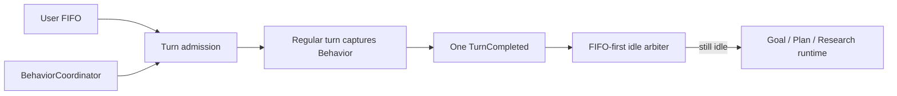

# Grow Turn、Behavior 与 Runtime 架构

Shell actor 是执行与控制权威，Pager 只消费结构化投影。核心不变量是：一个 foreground owner、一个用户 FIFO、一个 Behavior identity、一个原子 control snapshot。

## Turn admission

```rust
enum ForegroundState {
    Idle,
    RegularTurn(AgentTask),
    Compaction,
}
```

`InputItem` 只保存 message id、内容、origin 与 turn kind，不保存 Behavior。消息真正获得 foreground 时，`TurnContext` 捕获当前 `BehaviorId`；该 turn 的 prompt、工具面和限制随后保持不变。切换 Behavior 不重标队列，也不改变已经运行的 turn。

完成顺序固定为：结算 exact foreground owner → 排队持久化唯一 `TurnCompleted` → 提升用户 FIFO → 若仍 idle 再运行专用 runtime hook。Goal continuation 不进入 FIFO，synthetic work必须携带结构化 origin/lease。



输入语义见 [input-routing.md](./input-routing.md)。

## 唯一 Behavior identity

`tool_types::BehaviorId` 是 Shell、Tools 与 Pager 的唯一身份：`Normal | Clarify | Plan | Workflow | DeepResearch | Goal`。代码内部不再保留 Behavior 含义的 `SessionMode` 或 `PromptMode`；ACP 的 `SessionModeId` 只是外部传输字段名。Pager 的 `PromptMode` 仅表示输入框是否正在编辑排队消息，与 Behavior 无关。

`BehaviorCoordinator` 是纯决策器：输入当前选择与 `BehaviorSwitchFacts`，输出 `Applied | ConfirmationRequired | Rejected` 及 declarative effects。它不运行模型、不等待子 Agent、不写文件、不触碰 Pager。SessionActor 串行执行 effect，并在取消 owned work 之前先持久化目标 control snapshot。

专用 Plan、Goal、Deep Research runtime 继续拥有各自状态机；不建立包含所有 phase 的巨型通用状态机。

## Behavior 语义

| Behavior | foreground 对话 | 工具/权限 | owned work 与切换 |
|---|---|---|---|
| Normal | 标准 regular turn | 普通 Agent 权限 | 可立即切换 |
| Clarify | 对抗性问答，逼近目标与决策 | 不额外限制；副作用仍走普通权限 | 无 runtime，可立即切换 |
| Plan | Drafting/Awaiting/Amending 只规划；Executing 执行批准计划 | 非 Executing 拒绝 workspace mutation；Executing 恢复普通权限 | 离开未结束 Plan 需同目标二次确认并取消 Plan-owned foreground |
| Static Workflow | 主 Agent正常对话与整合 | 普通权限与 workflow tool | Behavior 不拥有已启动的公共 run |
| Deep Research | 首条 query 启动私有研究；后续 foreground 正常回答 | foreground 与 worker 都只读 | 普通消息不重启；离开 active run需确认并生成取消报告 |
| Goal | 所有阶段可正常对话 | 主 Agent 获得 Goal scoped tools | 未 complete/clear 前独占 Behavior；planner/verifier 不占 foreground |

Plan 的 artifact revision/hash 与 phase 存在 control snapshot；Plan 文档是 Plan Behavior 的审批产物，不是 Goal 黑板。Static Workflow run属于公共 workflow runtime。Deep Research 只拥有 control snapshot 中明确记录的 run id。

## 切换矩阵

| 状态/动作 | 结果 |
|---|---|
| 相同 Behavior 重选 | 幂等 Applied，并清 pending confirmation |
| 普通 Behavior 切换 | 只影响之后 admission；当前 turn 保持捕获的 Behavior |
| unfinished Goal → 非 Goal | 拒绝 |
| Plan → 其他、且 Plan 未结束 | 第一次进入 8 秒确认窗；同一 source/target 再选才应用 |
| active Deep Research → 其他 | 同上；确认后只取消 owned run并输出取消报告 |
| public Workflow active → Plan/Goal/Deep Research | 拒绝 |
| Plan/Goal/Deep Research 内启动或恢复 public Workflow | 拒绝；pause/stop/save 等管理操作仍可用 |
| completed Goal receipt + 任意 Behavior 切换 | receipt 保留；只有显式 `/goal clear` 删除它 |
| 模型切换、stage terminal、synthetic wake | 不能确认或清除 pending user switch |

确认窗是 transient 用户交互状态，不持久化。只有用户的 mode selection/明确 slash control会调用该路径；runtime completion 不通过它“顺手切模式”。

## Agent 权限交集

工具必须同时满足：

`registered tools ∩ Agent definition ∩ Behavior policy ∩ delegated grant ∩ user permission`

工具 taxonomy 必须明确；所有子 Agent（包括 `All` delegated grant）对 `kind: None` fail closed，`All` 只代表所有已分类 capability。permission mode 只决定一个已允许副作用是否需要批准，不能授予 capability。Behavior policy按 admission 捕获的 Behavior过滤工具，因此运行中的 Normal turn不会因 picker 切到 Goal突然获得 Goal工具，Plan turn也不会中途失去 edit gate。

Deep Research foreground 只保留明确 `ToolScope::Read` 的工具；未分类工具同样被拒绝。Goal role/object权限见 [goal-continuation.md](./goal-continuation.md)。

## 原子 control snapshot

`session-control.json` 包含 architecture version、control revision、Behavior snapshot、Plan phase/approval/artifact revision/hash、Goal state/receipt 与 Deep Research owned run id。

- 控制命令收到持久化 ack 后才返回 Applied/成功。
- 先持久化将要到达的控制状态，再取消 exact foreground/owned run并发布 UI projection。
- Goal finalization 的 `TurnCompleted` 携带结构化 origin/turn kind/goal id/stage id，并与 control ack共享同一有序 persistence actor，确保 terminal先落盘，再写 Complete/Normal。若进程恰在两次写入之间退出，恢复器从 durable terminal 对账并补写 Complete receipt，不重复 final report。
- Plan 的 submit/approve/reject/abandon 都等待 control ack；持久化失败时恢复内存中的前一 Behavior snapshot，不向模型或 Pager 发布不可恢复的相位。
- Plan 恢复校验 artifact hash；Deep Research 校验 owned manifest。失败均恢复 Normal且不删除公共 Workflow。
- current architecture 的 Goal内部冲突 fail closed为 Paused并保持 Goal；旧 architecture 直接清除并 Normal。
- split `behavior.json`/`goal/state.json` 不迁移，检测后诊断并删除。
- session fork把 Goal/Deep Research清为 Normal，不复制 runtime ownership。

## Pager 与 motion

Shell 在 `AvailableCommandsUpdate.meta["grow/behaviorAvailability"]` 发布由 `BehaviorCoordinator` 同源生成的结构化选择快照；Pager 只用它显示支持性、临时不可用原因和需确认状态。真正切换仍由 Shell 对最新事实重新校验。连接初始化期间尚未收到该字段时，Pager 只以 Shell 同一消息中的命令/工具目录作短暂降级，不从本地 UI 或动画状态推断 runtime ownership。

Pager 同样只消费 Shell 发布的 foreground identity、Goal task projection和 `AgentActivityProjection`，不重复推断 owner。

optimistic user bubble 与 ACP echo只按 `messageId` 对账；不用 trim 文本、skip boolean或 adoption stash。Goal Planning/Verifying、Deep Research、公共 Workflow、watcher和 subagent wait都进入统一 activity projection。

spinner、wave、timer、title和任务符号只消费同一 draw的 `FrameStamp`。animation deadline、UI expiry、lifecycle watchdog和scroll deadline互不短路；详见 [pager-motion.md](./pager-motion.md)。

## 静态禁止项

- 队列携带/重标 Behavior；
- prompt-id前缀或 token/status组合推断 origin；
- hidden Goal turn、GoalSummary/GoalControl/GoalClassifierNudge；
- Pager文本 echo/adoption协议；
- view tick counter或render修改liveness/session；
- Goal全文写工具、Goal TodoState或Goal `plan.md`；
- 受限 Agent默认放行未分类工具。
