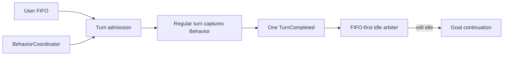

# Grow Turn、Behavior 与 Runtime 架构

Shell actor 是执行与控制权威，Pager 只消费结构化投影。核心不变量是：一个 foreground owner、一个用户 FIFO、一个 Behavior identity、一个原子 control snapshot。

## Turn admission

```rust
enum ForegroundState {
    Idle,
    ApplyingControl,
    RegularTurn(AgentTask),
    Settling { prompt_id: String },
    Compaction,
}
```

`InputItem` 只保存 message id、内容、origin 与 turn kind，不保存 Behavior。消息真正获得 foreground 时捕获当前 `BehaviorId`；该 turn 的 prompt、工具面和限制随后保持不变。用户 picker 的 Behavior transition 与 foreground admission 共享 session state mutex；Shell 先捕获 termination、pending step control 和 foreground owner，再由 `BehaviorCoordinator::assess_switch` 同时生成 picker projection 与服务端 admission。`Picker`、`HostCommand`、`GoalLifecycle` 是显式 authority，不能互借 busy 例外；不可用判定也不能修改二次确认 latch。Goal lifecycle 工具可以在已 admission 的 turn 内原子提交下一状态，但不会重标当前 turn，也不会把新协议插进已经运行的因果单元。Normal/Clarify foreground 允许 picker 原子提交 Plan 或 Workflow：旧 turn 保持已捕获的 Behavior，新 Behavior context 等待 terminal fence 后激活；out-of-band `/goal` 则先持久化 Goal Behavior，再由命令平面取消原 exact foreground。Plan/Workflow owned work、HostCommand 与 Compaction 的 foreground gate 均不放宽。

Agent/model route control 与 Behavior admission 还共享 `step_control_gate`。待处理状态包含 Sampling、Agent 的 desired slot 和有序控制队列；只看队列长度无法判断 Agent 是否正在异步重建。因此 Goal/Plan/Workflow 的能力校验、Workflow admission 校验、durable Control commit 与 live Behavior swap 必须在同一 gate 内完成，并在取得 gate 后读取当前已提交 Agent。durable/live commit 完成后才释放 gate；随后需要取消旧 foreground 的操作在 gate 外执行，避免取消路径反向等待同一边界。

Behavior 协议不再拼进或替换 system head。Timeline `control` 事件把权威选择与一个 `<behavior-context>` synthetic user 项原子提交。Idle transition 立即进入 Surface；Goal 完成、Plan 结束等 turn 内 transition 先留在 Timeline fold 的 pending slot，durable `TurnEnded` 后只激活最后一个，因此不会插进 tool call/result，也不会排在旧 Behavior 所产生的迟到输出之前。下一次请求沿原位置重放，provider-visible 前缀保持 append-only。切回 Normal 会物化明确的 reset，较早的特殊协议只保留为因果历史，不再处于活跃状态。

完成顺序固定为：runner 返回后把 exact foreground owner 转入 `Settling` → 确认 Timeline turn terminal 与唯一 `TurnCompleted` 已持久化 → 释放 foreground fence → 提升用户 FIFO → 若仍 idle 再运行专用 runtime hook。`Settling` 仍然是 foreground ownership，Goal continuation 不进入 FIFO，synthetic work必须携带结构化 origin/lease，因此首条 Goal objective 的外层 user turn 不可能被 continuation 的 `TurnStarted` 越过。

普通采样的 `prompt_cache_key` 由 Timeline identity、最新 rewind 分支锚点、完整 model route（backend/base URL/model）和 runtime continuation epoch nonce 派生。保持原前缀的普通 append 不改变该键；fork、rewind、route 切换和 continuation reset 会改变。Behavior 或 Agent 控制是否影响该键，取决于请求前缀是否仍能通过 continuation 校验，不能仅按控制名称判定。重启创建新 epoch，不复活历史 native state。该键只负责 provider 粘性路由，不能替代 provider-visible 前缀相等校验。

Session 的 catalog identity、provider sampler config、reasoning effort 与 transport 由 actor 作为一个带 revision 的 `SessionModelRoute` 提交。catalog identity 始终是完整的 `provider/model`；`SamplingConfig.model` 只是发给 provider 的 wire model，不能用于 catalog、凭据、超时或重试策略反查。SessionHandle、模型菜单、subagent spawn 和 catalog reload 都只读取该原子快照，不能分别读取 handle ID 与 ChatState route 后拼接。catalog reload 在全局 publication 临界区构造并发布一个 catalog generation，再把同一代快照排入每个 session mailbox；用户选择同样只在锁内冻结 catalog route，随后释放全局锁，不能让一个 busy session 的 acknowledgement 阻塞其他 prompt 或模型操作。

model 与 reasoning effort 组成一个 Sampling desired slot，Agent 使用另一个 slot；每个域只保留尚未提交的最新目标，被替代的 revision 返回 `Superseded`。GoalDefinition 等有序控制另存队列，catalog reload 仅在它仍是全局最新待处理项时合并并保留全部 responder。存活的 slot 与队列头按 admission sequence 选择，已被替代的目标不再构成顺序屏障。

请求在任何 Behavior 和 foreground 状态下都可被接受；活跃 step 继续使用开始采样时的 Agent/model route。模型 stream 和它产生的整个工具批次完成后，actor 提交 `StepEnded` 并捕获边界：有序控制只处理 cutoff 以内的项；边界时已有的 Sampling/Agent 域可以在提交前追随最新 revision，每个域在此边界最多提交一次；边界之后才首次出现的域留待下个边界。随后提交下一次 `StepStarted`。AgentRole context 在 step 边界进入 Surface；Behavior context 仍等待 `TurnEnded`。Idle 时由 `ApplyingControl` fence 收束控制，再允许 compaction、用户 FIFO、notification 或 Goal continuation。失败只终结对应 revision，不重放已经提交的控制。

Catalog publication 与 selection 的 actor enqueue 共用一个全局事务锁，但任何 session acknowledgement 都必须发生在锁外：锁内只做 validate、freeze 与同步 `cmd_tx.send`，锁外才等待 session-local step/idle boundary。这样 load 不会与 catalog publication 环等，旧 provider route 也不可能在较新的 reload 之后才进入 mailbox。Pager 立即发送新的控制意图，各自替换 Sampling、Agent、Behavior 域的本地 correlation token，由 Shell 裁决 desired state；断线时每域只保留最新目标，重连后重新 dispatch。旧 RPC completion 不能清除新 token；Sampling 还须等权威模型投影匹配完整目标，单纯 RPC 成功不足以解除 pending。prompt barrier 在这些 pending control 收束前保持。effect 携带 client identity、binding generation、sequence 和 dispatch generation，重连提升 dispatch generation，阻止旧 transport 的 completion 覆盖恢复后的状态。

上述边界由 Shell 的 `step_boundary_retargets_a_sampling_revision_superseded_before_commit`、`step_boundary_defers_a_control_domain_first_admitted_after_step_ended` 等测试，以及 Pager 的控制重连测试约束。早期“所有用户选择排队逐项执行、仅一个 RPC 在途”的设计已被 desired slot 语义替代。



输入语义见 [input-routing.md](./input-routing.md)。

## 唯一 Behavior identity

`tool_types::BehaviorId` 是 Shell、Tools 与 Pager 的唯一身份：`Normal | Clarify | Plan | Workflow | Goal`。代码内部不再保留第二套 Behavior identity；ACP 的 `SessionModeId` 只是外部传输字段名。Pager 的 `PromptMode` 仅表示输入框是否正在编辑排队消息，与 Behavior 无关。

`BehaviorCoordinator` 是纯决策器：输入当前选择、`BehaviorSwitchFacts` 与 request authority，先输出唯一 `BehaviorAvailabilityEntry`，再把同一个 assessment 解析为 `Applied | ConfirmationRequired | Rejected` 及 declarative effects。它不运行模型、不等待子 Agent、不写文件、不触碰 Pager。SessionActor 串行执行 effect，并在取消 owned work 之前先持久化目标 control snapshot。所有异步持久化入口都先复制 owned `BehaviorSnapshot`/`GoalState`，同步锁 guard 不得跨越 Timeline await。

Plan 与 Goal 各自保留必要的专用状态。Workflow Definition/Run 统一走 Workflow Workspace 与 manager，不再按用途派生私有 runtime。

## Behavior 语义

| Behavior | foreground 对话 | 工具/权限 | owned work 与切换 |
|---|---|---|---|
| Normal | 标准 regular turn | 普通 Agent 权限 | 可立即切换 |
| Clarify | 对抗性问答，逼近目标与决策 | 不额外限制；副作用仍走普通权限 | 无 runtime，可立即切换 |
| Plan | Drafting/Awaiting/Amending 只规划；Executing 执行批准计划 | 非 Executing 拒绝 workspace mutation；Executing 恢复普通权限 | 离开未结束 Plan 需同目标二次确认并取消 Plan-owned foreground |
| Workflow | 主 Agent正常对话与整合 | 普通权限与 Workflow tool | Behavior 是公共 Definition/Run 管理的唯一入口，但不拥有已启动 Run 的生命周期 |
| Goal | Active 时正常对话并在 idle 后继续；stopped Goal 只是持久目标记录 | 主 Agent 获得 Goal scoped tools | 只有 Active Goal 选择 Goal Behavior；pause/block/budget limit 释放为 Normal，restart 再激活 |

Goal 的 provider usage 缺失时，持久计数只能作为下界，必须保留 `usage_incomplete`。但是统计是否完整和是否允许继续执行是两件事：没有设置 token budget 时，没有需要精确执行的预算上限，因此网络错误仍走普通重试，Goal 可以继续，不能仅因 usage 缺失暂停或取消后台压缩。带 token budget 时仍然关闭新的 provider admission，并在安全的 Step 边界暂停；用户需要先移除预算再 restart，或者重建 Goal。已有下界账本不能重新安装精确预算，restart 也不能伪造或清除历史 usage。普通终态错误、用户暂停和已耗尽的预算仍按各自规则停止 Goal。

Plan 的 artifact revision/hash 与 phase 存在 control snapshot；Plan 文档是 Plan Behavior 的审批产物，不是 Goal 黑板。Workflow Workspace 持久化 session 草稿与 Definition 焦点，Run 属于统一公共 runtime。`deep-research` 由 builtin extractor version-managed 到 `~/.grow/workflows/deep-research.rhai`，每次启动幂等核验后作为普通 User workflow 由 Registry 扫描，不拥有额外 scope、Behavior 或运行机制。

Plan 模式的 `ask_user_question` 在 Pager 中拥有完整的 `Navigation | InputMode | PlanAction` 焦点状态。`Chat about this` 与 `Skip interview` 是固定、可键盘到达的 typed response；当前部分答案随响应返回，不通过 prompt queue、Interject 或伪造 UserMessage 旁路提交。

Goal turn 的 lifecycle mutation authority 以当前 prompt、Goal id、definition revision 与 active status 为边界。全局 Control revision 仍保护尚无 Goal owner 的创建操作，但 Goal 已激活后，usage、reminder、context reprojection 或 compaction checkpoint 不属于定义变更，不能撤销同一 turn 的 `update_goal` 权限。

## 切换矩阵

| 状态/动作 | 结果 |
|---|---|
| 相同 Behavior 重选 | 幂等 Applied，并清 pending confirmation |
| 普通 Behavior 切换 | 只影响之后 admission；当前 turn 保持捕获的 Behavior |
| Active Goal → 非 Goal | 先显式 pause/complete/clear；Goal lifecycle 与 Behavior 原子提交 |
| stopped Goal + 任意 Behavior | 允许；Goal 记录与当前 Behavior 正交 |
| Plan → 其他、且 Plan 未结束 | 第一次进入 8 秒确认窗；同一 source/target 再选才应用 |
| public Workflow active → Plan/Goal | 拒绝 |
| Plan/Active Goal 内启动或恢复 Workflow | 拒绝；pause/stop/save 等管理操作仍可用 |
| completed Goal receipt + 任意 Behavior 切换 | receipt 保留；只有显式 `/goal clear` 删除它 |
| 任意 Behavior/foreground + model/effort/Agent 选择 | 接受并排队；当前 step 不变，在 `StepEnded` 后、下一次采样前按序提交；idle 时立即提交 |
| live child + model/effort/Agent 选择 | 精确路由到 child actor；不修改父会话，也不把 child 提升进主 roster |
| 模型切换、stage terminal、synthetic wake | 不能确认或清除 pending user switch |

确认窗是 transient 用户交互状态，不持久化。只有用户的 mode selection/明确 slash control会调用该路径；runtime completion 不通过它“顺手切模式”。

Pager 收到 `confirmation_required` 后，在 Shell 确认窗内锁定输入框并提示 `Enter` 确认、其他任意键取消。`Enter` 通过现有 selection 通道重选目标，取消则重选当前权威 Behavior 以清除 Shell latch；两者均吞掉本次输入并保留草稿，粘贴按取消处理。提示到期、切换结果返回或会话重载时清除交互状态。

Plan/Goal lifecycle 工具是采样批次的状态屏障。一个 provider batch 只要包含
`PlanControl` 或 Goal lifecycle update，就只执行按 provider 顺序出现的第一个控制调用；
同批其他读写、执行和后续控制调用全部通过统一 cancellation/result 路径闭合，然后重新采样。
因此控制调用之前或之后都不存在可以越过新 phase/Goal definition 的普通副作用。

## Agent 权限交集

工具必须同时满足：

`registered exact identity ∩ Agent hard eligibility ∩ Behavior policy ∩ projected RWX ∩ call permission ∩ one-shot permit`

每个注册工具只在 descriptor 声明一次 RWX 上界，`ToolKind` 只负责展示与检索，不能参与授权。冻结参数经唯一 call projector 得到本次所需 RWX，并证明它不超过 descriptor 上界；未知 descriptor、未知动态输入和未知 MCP trust domain 都按 `All` fail closed。permission mode 只决定一个已允许副作用是否需要批准，不能授予 capability。Behavior policy按 admission 捕获的 Behavior约束调用，因此运行中的 Normal turn不会因 picker 切到 Goal突然获得 Goal工具，Plan turn也不会中途失去 edit gate。

Workflow Definition 使用同一 Agent capability、MCP binding 与 PermissionManager 交集；`deep-research` 不获得额外的 Behavior 级权限。Goal role/object 权限见 [goal-continuation.md](./goal-continuation.md)。

`SubagentCapabilityState` 是子 Agent 唯一的 native identity eligibility 与初始 RWX 事实源。当前 Agent authored snapshot 以精确 wire tool identity 定义 eligibility；用户显式切换 Agent 时，这一投影在 `ApplyingControl` fence 内随新 harness 原子替换并提升 authorization epoch，不能出现新 schema 已显示、旧投影却永久拒绝的半状态。delegated mode 始终是不可变初始 RWX，未声明时统一取 `ReadWrite`；Agent 切换只重新授权 authored identity，不能扩大 RWX 或 MCP transport authority。工具 catalog 标出 available/locked/forbidden：初始 RWX 内的调用沿用普通快速路径，RWX 外但 eligible 的精确调用直接进入 Ask/Auto，当前 Agent eligibility 外则在提示前拒绝。允许不会修改 session authority，而是只签发一次性 permit，绑定 actor epoch、call id、真实 target、canonical args、cwd、projected RWX 与 MCP generation，公共 dispatch 边界消费前重验。每个 child handle 另持不可变 `DelegableCapabilityCeiling`：nested child 在创建资源前将请求 mode 与 immediate parent 初始 mode 做偏序交（`ReadWrite ∩ Execute = ReadOnly`），且只能继承 ceiling 中同一 transport ID 的 MCP binding；父会话的审批历史永不扩大后代 ceiling。生命周期展示可以把 nested child 归并到根 Session，但 `SubagentSpawnEvent.security_parent_session_id` 永久记录直接安全父级；只有根 owner 或同一直接安全父级可以恢复该 child，兄弟 child 不共享恢复权限。live child 的控制寻址使用单独的 scoped registry，随 child runner 以 RAII 注册/清理；它只开放 model/effort/Agent 这类 exact-session control，不进入 primary session roster、prompt/load 路由或权限所有权。Agent identity 与 `subagent_filter` 是 actor 提交、所有 handle clone 共享的单一 route，nested delegation 不会继续读取切换前快照；`ModelChanged`/`AgentChanged` 也在 actor fence 内发布，RPC 断连不会造成权威状态与镜像分裂。普通 child 会在注册后追赶构造期间错过的 catalog generation，自动 reload 的 convergence domain 覆盖 primary 与这些 live child，失败即 fail-closed shutdown；Workflow-owned child 携带 Run identity 并排除自动 reload，因为它的 model route 与 subagent filter 都冻结在 durable Run snapshot 中。显式 exact-session model/effort/Agent 控制仍然可用。

子 Agent 的 permission mode 只有 `Ask / Auto / AlwaysApprove`，在 child 创建时独立解析；主会话后续切换 mode 不广播给 child，内部缺失 child route 时按 `Auto` 收口而不是继承 primary live mode。子 Agent 的 locked exact-call Auto 裁决由 primary session 承担，但这是裁决执行位置，不是权限模式继承。未被权威规则直接解决的精确调用按 `[subagents].classifier_input` 创建临时判断分支：默认 `context` 从主 ChatState 当前压缩状态中只提取带 first-party `PermissionEvidence` 的真实用户任务/插话，排除 assistant、tool result、summary 与 synthetic user-role 内容，再追加结构化调用事实；`request_only` 只携带待裁决动作以节省 token。`PermissionEvidence` 在真实 ingress 铸造并随本 session 的 JSONL replay 原样恢复，缺失或未知值 fail closed，不能由 role 或 `promptIndex` 推导；fork 会保留历史文本但清除该证据，因为 child 是新的权限域，subagent 的权限只能来自 typed spawn capability ceiling。两个分支都禁用工具、使用主会话 active model，并只返回严格的 `{decision, reason}`；推理强度统一服从 `[auto_mode].reasoning_effort`，未配置时保持 unset，不继承主 turn 的高推理强度。Responses/Messages 使用 native JSON Schema，Chat Completions 使用跨 OpenAI-compatible provider 的 JSON Object wire contract 后做相同的本地严格校验。完整最大 attempt（包含输出 schema）先冻结 Sideband 预算；空响应、schema 错误、可恢复 API/transport error 和单次 attempt timeout 共用最多两次的有限尝试器，两次 attempt 共享一个总 deadline，不可恢复的 auth/request error 立即 fail closed。临时消息、原始模型结果和结构化裁决都不得写回 ChatState、memory、compaction、fork context 或普通 ConversationItem。`[auto_mode].classifier_model` 只服务主会话自身分类路径，不覆盖子 Agent 的主上下文裁决模型。

权限拒绝是子 Agent 的工具级结果，不是 turn 级终止：Auto deny/unavailable、人工 Reject/TimedOut 和 stale permit 都让当前工具 fail closed，并把可操作的失败结果交回下一次子模型采样；只有明确 Cancel、父任务终止或 session teardown 可以取消子 turn。最终 `PermissionEvent` 是审计事实源，经 primary session 的 audit bridge 持久化为 UI-only update。Pager 将同一主 Agent turn 内到达的事件保留在一个带 epoch 的稳定结构化权限块中；status、tool 等中间消息不会拆组，只有真实 `TurnCompleted` 推进 epoch 并封口。展开成员始终单行，双击成员读取完整 live 请求和 classifier reason；持久化 replay 只恢复脱敏安全摘要。该块不复用 tool-verb 分类或其设置，也不进入模型上下文。

## Security authority boundaries

跨异步边界传递的不是“已经检查过”的布尔值，而是冻结且不可拆分的 identity/capability：

- Folder Trust 绑定当前 checkout 的 canonical path、filesystem object identity 和 Git common-dir identity。managed source 只能作为额外 provenance conjunct，不能代替当前 checkout；linked worktree、后来 clone 的目录与同路径 replacement 都是新 identity。Pager 在展示前冻结 identity，确认写入前后都重验；任一次 current/source 读取失败或 CAS 漂移都保持 Pending/fail closed，不启动 Session。store 与进程 cache 也只按完整 identity 精确命中。
- Hook occurrence 在 Timeline `Triggered` 中冻结 config generation、来源层级与有序 handler plan。session resume 从历史最大 generation 的下一代开始，不能复用旧代；未知来源不能执行，project/agent file 在 `Triggered` durable 后、外部副作用前重新验证当前 Folder Trust。低权限来源只能贡献其 provenance 层允许的 handler，不能覆盖高权层的 policy。每个 cause 必须引用当时合法的 active/terminal Tool、Turn、Compaction、Subagent、Notification 或 Session identity。
- Memory embedding 与 Bundle download 都把 endpoint authority 和 credential 封装成同一个 opaque capability。Memory 的 live credential 只绑定进程拥有的 exact non-loopback HTTPS service URL；用户静态 key 也只随其 exact endpoint 使用。Bundle 使用独立的 `GROW_BUNDLE_SERVICE_BASE_URL`，绝不回退到 chat/model proxy；缺 URL 或 deployment key 就禁用同步。两条 HTTP 路径都禁止 redirect，错误正文与展开 URL 不进入持久化诊断。
- MCP client event 只由 `McpState` 为当前 `{client_id, config_generation, transport_revision}` episode 签发。config diff 与 transport-origin event 走不同 typed API；caller 不能构造 episode 或取得 raw sender。remove/replacement 立即撤销旧 eligibility，旧 transport 的 ready/liveness/tools/resources/handshake/closed 事件都不能污染新实例或 permit。
- Sandbox 与 sampling 保留 typed denial。permission/sandbox/network-policy/quota 拒绝不能降级成可重试的普通采样错误。Linux child filter 的威胁回归覆盖 socket family/type mask、`sendmmsg`、x32/非 native arch 与 async I/O/io_uring 入口；进程创建时已经继承的 connected FD 仍是独立的长期边界，记录在 ROADMAP，不通过扩大本次 syscall filter 掩盖。

## 原子 Timeline Control 事件

Timeline 的 `control` 事件包含单调 control revision，以及 Behavior snapshot、Plan phase/approval/artifact revision/hash 与 Goal state/receipt。它是唯一持久控制事实；不存在 control sidecar。

每个 Control 事件同时声明本次原子退役的 model-context layer。退役只撤销该 layer 的当前 authority 与尚未跨过边界的 pending transition，不删除历史 Surface；后续 compaction 只能重投影仍然活跃的 layer。因此 Goal pause/complete/clear 与离开 Goal Behavior 会在同一 Control 事实中退役 `GoalDefinition`，旧 Goal 指令即使被 Surface replacement 遮蔽，也不能在后续修复中重新成为模型上下文。

- 控制命令收到持久化 ack 后才返回 Applied/成功。
- PlanControl 或 Goal lifecycle 工具成功提交后形成显式 control disposition。同批未开始的工具先以未执行结果闭合；`ResampleStep` 关闭当前 Step、激活新的 Plan phase context，并在同一 Turn 内重新采样，`EndTurn` 才写入 `TurnEnded`。失败或没有提交状态变化的控制仍返回 Continue，不能误取消兄弟调用。completion requirement、Stop hook 与 recovery 都不得在旧 phase/admission 下再次采样。
- 新 session 的 deferred stable prefix 是所有 prompt origin 共用的 admission barrier。User、Goal continuation、Workflow/task/subagent completion、notification 与 host command 在写入首个 `TurnStarted` 前都必须先 durable commit 该 prefix；不存在 synthetic turn 绕过 bootstrap 后再补 `ContextRebuild` 的合法路径。
- 显式 Stop/Cancel 与进程内 owner panic 都按 Request/Tool → Step → Turn 的顺序只追加终态。若 panic 发生在 durable `TurnEnded` 之后，不再投影第二个 completion，而是关闭 writer epoch；进程重启则由 Timeline interrupted recovery 追加缺失终态。
- 先持久化将要到达的控制状态，再取消 exact foreground/owned run并发布 UI projection。
- Goal finalization 的 Timeline turn identity 携带结构化 origin/turn kind/goal id/stage id，turn terminal携带 stop reason/completion kind；terminal与 Control事件共享同一有序 Timeline actor，确保 terminal先落盘，再写 Complete/Normal。若进程恰在两次写入之间退出，恢复器从 durable Timeline terminal对账并补写 Complete receipt，不读取 `updates.jsonl`，也不重复 final report。
- Plan 的 submit/approve/reject/abandon 都等待 control ack；持久化失败时恢复内存中的前一 Behavior snapshot，不向模型或 Pager 发布不可恢复的相位。
- Plan 恢复校验 artifact hash；Workflow Run 恢复只消费统一 Timeline lifecycle 与对应 snapshot。
- Goal 内部冲突 fail closed 为 Paused 并释放到 Normal；不支持的 architecture version 直接拒绝加载。
- Behavior 与 Goal 只通过 Timeline `control` 事件原子提交；不存在第二套控制状态读写路径。
- session fork 清除 Goal runtime ownership 并归一为 Normal；Workflow Run 不伪装成 Behavior 私有状态。

## Pager 与 motion

Shell 在 `AvailableCommandsUpdate.meta["grow/behaviorAvailability"]` 发布由 `BehaviorCoordinator` 同源生成的结构化选择快照；Pager 只用它显示支持性、临时不可用原因和需确认状态。真正切换仍由 Shell 对最新事实重新校验。连接初始化期间尚未收到该字段时，Pager 只以 Shell 同一消息中的命令/工具目录作短暂降级，不从本地 UI 或动画状态推断 runtime ownership。

Pager 同样只消费 Shell 发布的 foreground identity、Goal task projection和 `AgentActivityProjection`，不重复推断 owner。

optimistic user bubble 与 ACP echo只按 `messageId` 对账；不用 trim 文本、skip boolean或 adoption stash。Goal continuation、Workflow、watcher和 subagent wait都进入统一 activity projection。

所有 Workflow Run（包括 `deep-research`）只消费同一 `WorkflowUpdated` 投影，并统一出现在 transcript、tasks pane、activity、`/workflows` 与 `/workflow-run` 管理面。不存在 `private_workflow_runs` 或第二套终态投影。

child 会话的 `ask_user_question` 提问所有权留在 child 视图（兄弟 child 提问互相独立，不 hoist 到父视图），主界面通过父视图 turn-status ◆ 等待指示与 dashboard `NeedsInput`（顶层行与子代理行）立即呈现，回答走 child 全屏（subagent 提问不在 dashboard peek 提供作答；root 自己的提问仍可在顶层行 peek 中作答）。

spinner、wave、timer、title和任务符号只消费同一 draw的 `FrameStamp`。animation deadline、UI expiry、lifecycle watchdog和scroll deadline互不短路；详见 [pager-motion.md](./pager-motion.md)。

## 静态禁止项

- 队列携带/重标 Behavior；
- prompt-id前缀或 token/status组合推断 origin；
- hidden Goal turn、GoalSummary/GoalControl/GoalClassifierNudge；
- Pager文本 echo/adoption协议；
- view tick counter或render修改liveness/session；
- Goal全文写工具、Goal TodoState或Goal `plan.md`；
- 受限 Agent默认放行未分类工具。
