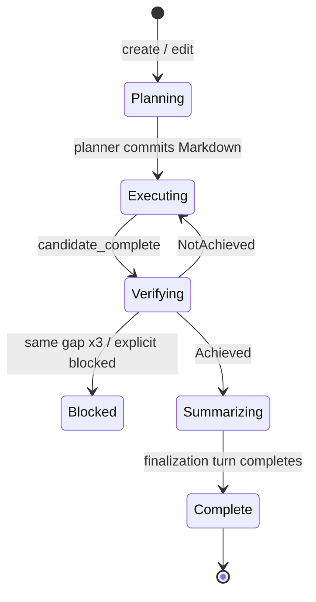

# Goal Runtime v3

Goal 是跨多个有限 regular turn 的持久自治任务，不是一个长时间占住输入的 turn，也不是 BehaviorController 内的第二套通用状态机。Shell actor 只在 foreground idle 且用户 FIFO 为空时驱动 Goal。

## 1. 持久状态

```rust
enum GoalStatus { Active, Paused, Blocked, BudgetLimited, Complete }
enum GoalPhase  { Planning, Executing, Verifying, Summarizing }

struct GoalPlan {
    revision: u64,
    markdown: String,
    updated_at: String,
    updated_by: GoalPlanAuthor,
}

struct StageLease {
    goal_id: String,
    objective_revision: u64,
    plan_revision: u64,
    stage_id: u64,
}
```

`GoalOrchestration` 持久化 objective、status、phase、预算、Markdown plan、验证反馈、历史和已结算 token。`in_flight_stage` 及实时统计是 transient；重载时清空，随后由 idle hook 按持久 phase 恢复。

`architecture_version` 当前为 3。旧版本不迁移：记录诊断、删除 `goal/state.json`，并在 session replay 后发出一次 `cleared` projection，避免 Pager 被旧 `GoalUpdated` 重新点亮。

## 2. 单一黑板

`GoalPlan.markdown` 是计划的唯一真相源。Pager 的 Plan 展示和审计信息都从这份 Markdown 派生，不再同时维护 `GoalPlanScope`、TodoState、`plan.md` 等可分叉副本。

- `/goal edit` 修改 objective，推进 `objective_revision`，清除旧 plan/候选/验证证据，并回到 Active/Planning；
- 普通用户消息或 steer 只是补充上下文，不推进 revision；
- `update_goal_plan` 完整替换 Markdown，推进 `plan_revision` 并进入 Executing；
- 任一 revision 变化都会让旧 `StageLease` 的结果失效。

## 3. 阶段状态机



### Planning

Planner 是后台 Goal stage：它不占 foreground，也不进入用户 FIFO。普通 user turn、steer 和主 turn cancel 都不会取消 planner。

stage 通过匹配 lease 提交完整 Markdown。意外失败会释放 lease，Active/Planning 状态由 idle hook 重拉；连续三次基础设施失败后转为 Paused。显式 pause/clear 会取消 stage、使 lease 失效并禁止自动重拉。

### Executing

idle hook 在 `ForegroundState::Idle && user_fifo.is_empty()` 时原子启动一个普通 internal continuation turn。它带结构化 `PromptOrigin::GoalContinuation`，走标准 sampler、工具、持久化与唯一 `TurnCompleted` 管线。

用户 FIFO 一旦非空，本轮 Goal admission 直接返回；用户工作不会被 continuation 抢占。

### Verifying

`update_goal { action: candidate_complete, ... }` 只记录候选并立即向模型返回“等待验证”，不在工具调用里等待 verifier。

Verifier 是后台 stage，校验最新 objective revision、plan revision、候选结果与工作区证据：

- `Achieved`：进入 Summarizing；
- `NotAchieved`：把 feedback/fingerprint 写回持久状态并回到 Executing；
- 同一 gap fingerprint 连续三次：进入 Blocked；不同 gap 重置计数；
- verifier 明确判断环境无法完成：直接 Blocked；
- 过期 lease 的结果静默丢弃。

Planning/Verifying 期间 foreground 仍可运行普通 user turn，Pager 只用 Goal chip 显示阶段。

### Summarizing

idle hook 启动一个 `PromptOrigin::GoalFinalization` regular turn，由主 agent 输出最终用户汇报。成功终态后状态变为 Complete，并离开 Goal Behavior 回到 Normal。没有 strategist 或独立 summarizer 子 agent。

## 4. 控制面

`/goal` 与 Behavior picker 共用同步 control-plane handler。控制面不采样模型、不排 hidden prompt、不等待 actor 自己的 mailbox。

- create/edit：进入 Active/Planning；
- pause：保持 Goal Behavior，取消 transient stage；
- resume：恢复 Active，由 idle hook 继续当前 phase；
- clear：删除 Goal 并回到 Normal；
- Goal 未 complete/clear 前拒绝切换其他 Behavior。

Goal Behavior 中暴露三个模型工具：

- `get_goal`：读取 objective/status/phase/预算/blackboard/feedback；
- `update_goal_plan { markdown, reason? }`：替换唯一黑板；
- `update_goal { action: candidate_complete | blocked, message }`：提交候选或阻塞证据，立即返回。

Goal 之外不暴露这些工具。

无参数工具仍必须导出合法的 JSON Schema object 根；`get_goal` 的 wire
input 是显式空对象 `{}`，不能用无约束 `serde_json::Value` 生成 `null`
schema，否则 provider 会在采样前拒绝整个 turn。

运行能力按 live tool bridge 判定，不能只看配置开关。只有三个工具同时存在时 Goal idle hook 才能 claim stage；运行中丢失任一工具会以 Infra 原因持久化为 Paused。session restore 同样先验证工具能力，再允许 Active Goal 进入 idle arbiter。

会使当前执行上下文失效的控制（成功的 set/edit/enter/pause/clear）会取消当前 regular turn，但保留已经进入 interjection buffer 的用户补充；status/resume/budget 不取消。判断依据是控制前后的结构化 Goal/Behavior 状态，不是命令文本本身，因此被拒绝的 edit/set 不会误伤 turn。

## 5. Idle hook 与并发规则

Goal runtime 只通过 `drive_goal_on_idle` 启动工作：

1. Planning/Verifying 可 claim 一个 transient stage lease 并后台执行；
2. Executing/Summarizing 必须再次持有 foreground/FIFO 锁检查 idle；
3. stage completion 通过 actor event 提交，只有当前 lease 可改变状态；
4. 状态改变后唤醒 idle arbiter；
5. regular turn 完成后先提升用户 FIFO，只有仍 idle 才调用 Goal hook。

regular turn 的错误按 `PromptOrigin` 归属。普通用户补充即使在 Goal
Behavior 中失败，也不能暂停 Goal；只有 `GoalContinuation` 和
`GoalFinalization` 的错误进入 foreground Goal 降级。Stop Turn Only 结算
foreground 后仍会唤醒 idle arbiter，使 Active Goal 在 FIFO 为空时继续。

这个协议取代了 `GoalSummary`、`GoalControl`、`GoalClassifierNudge`、prompt-id 前缀、planner/classifier CAS latch、D1-D6 gate 和 synthetic placeholder cycle。

## 6. 预算与恢复

Token 预算在启动新的 Executing work 前结算；超限进入 BudgetLimited，不再自治。父 session token 用单调 high-water 结算，Goal-owned subagent 在终态时把 marginal token 结算到 `subagent_tokens_spent`。subagent ownership 在 stage/turn 创建请求时写入 `SubagentOwner::Goal { goal_id }` 并随 spawn lifecycle 传递；绝不能在迟到事件到达时读取“当前 Goal”反推，否则 clear 后新建 Goal 会继承旧 planner 的账单。优雅退出还会先取消 transient stage、结算最后一次已知进度，再经过 persistence barrier。也就是说，重载不会把 planner/verifier 已经花掉的预算重新送给 Goal。

Active Goal 重载后保留 phase/plan/revisions，丢弃 transient lease，并由 idle hook 恢复。Paused、Blocked、BudgetLimited 和 Complete 不自动启动 stage。Complete 是冻结的 receipt，之后的 Normal turn 不得继续增加它的 token 或 elapsed。

## 7. Session 与存储边界

Goal 有自己的 `goal/state.json`，Behavior 使用 `behavior.json`，这两个文件不是一个事务。所以恢复时不能分别相信它们，而是用 Goal state 做一次 reconciliation：

- unfinished Goal 强制恢复为 Goal Behavior；
- Complete receipt 强制恢复为 Normal；
- 没有 Goal state 却残留 Goal Behavior 时恢复为 Normal；
- malformed、内部不一致、architecture version 不匹配，或者当前 session 禁用了 Goal runtime 时，拒绝加载并清除 Goal。

所有 Goal 写入使用 atomic replace。malformed 文件不会让整个 session load 失败，但会被删除，避免每次重载重复读取同一个坏状态。Active Goal 也计入 session `IsBusy`，因此 planner/verifier 虽然不占 foreground，却不会在 client disconnect 的 idle unload 中途被当成“没有工作”。Paused/Blocked/Complete 可以正常卸载，下一次从持久状态恢复。

session fork 只复制对话上下文，不复制 Goal runtime state。原因很简单：Goal 是原 session 的执行所有权，不应该因为 fork 产生两个拿着同一个 `goal_id` 的调度器。

Goal 黑板没有 prompt-indexed 快照，因此只要 session 中还存在 Active、Paused、Blocked、BudgetLimited 或 Complete receipt，用户 rewind 就会被拒绝。必须先 `/goal clear`；不能让对话或文件回滚后仍保留指向旧工作区证据的计划和验证结论。

## 8. 验证不变量

- 同一 Goal 同时至多一个 `StageLease`；
- revision 不匹配的 stage 不能提交；
- planner/verifier 与 regular turn 可并行；
- cancel regular turn 不取消后台 stage；
- 用户 FIFO 永远优先于 continuation/finalization；
- candidate tool 调用永不等待 verifier；
- complete 只能由 verifier Achieved 后的 finalization terminal 产生。
- finalization 只有 `Completed + EndTurn` 才能生成 Complete receipt；refusal、cancel、max-turn 和 stationarity 都不是成功汇报；
- finalization 完成离开 Goal 前，必须把期间排队的 Goal-mode 用户补充重标为 Normal，再允许 FIFO 提升；
- 用户 turn 的 provider/tool schema 错误不得降级或暂停 Goal；
- unfinished Goal 与 Goal Behavior 在重载后必须一致；
- malformed/旧 architecture Goal 不能阻塞 session load，也不能在 replay 后留下幽灵 chip；
- Goal-owned subagent token 在 reload 后保持单调，Complete receipt 的账单保持冻结；
- Active Goal 即使 foreground idle，也不能被 session idle-unload。
- Goal state 存在时 rewind 必须先显式 clear，不能产生历史与黑板的部分回滚。
- Goal 工具能力未经 live bridge 证明时不能 claim stage，能力丢失必须 fail closed 为 Paused。
- subagent 的 Goal ownership 必须由 producer stamp；迟到的旧 Goal 事件不能计入新 Goal。
