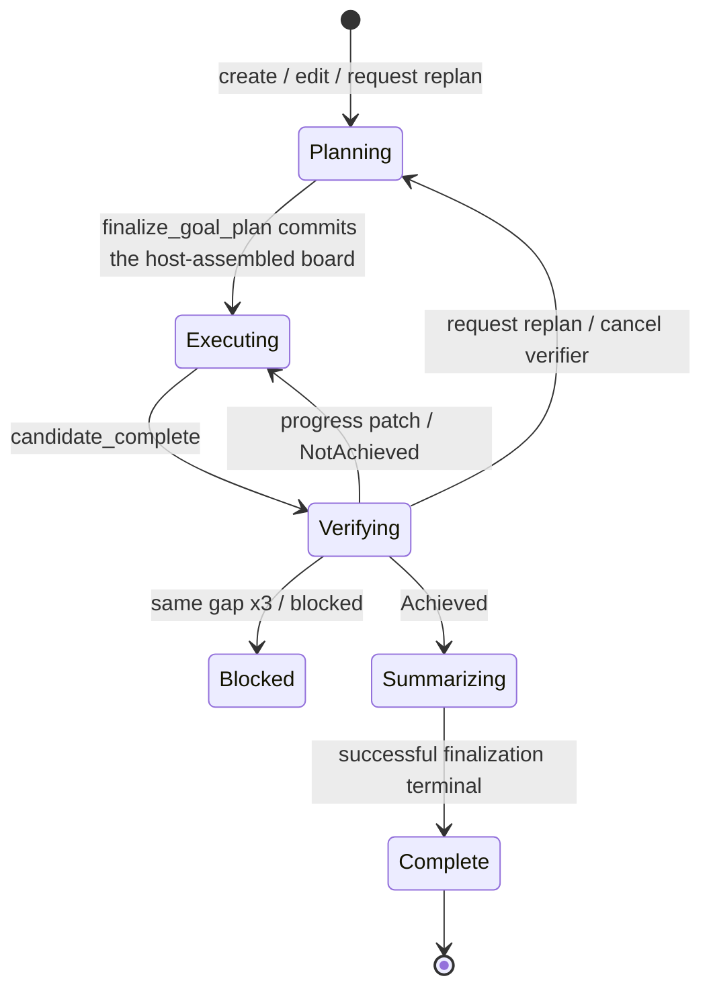

# Goal Runtime v5

Goal 是未完成期间独占的用户可见 Behavior，但不独占 foreground。Planner 与 Verifier 是后台 stage；用户 turn、steer、cancel 和 Goal stage 可以并行，所有 regular turn 仍由唯一 `ForegroundState` 调度。

## 持久状态

```rust
enum GoalStatus { Active, Paused, Blocked, BudgetLimited, Complete }
enum GoalPhase  { Planning, Executing, Verifying, Summarizing }

struct GoalBoard {
    plan_revision: u64,
    board_revision: u64,
    markdown: String,
    updated_at: String,
}

struct StageLease {
    goal_id: String,
    objective_revision: u64,
    plan_revision: u64,
    board_revision: u64,
    stage_id: u64,
}
```

`GoalOrchestration` 与 Behavior 一起存入原子 `session-control.json`。stage lease、取消句柄、当前子 Agent、实时 token、activity projection、动画状态以及 planner 分段 staging（已接受段、上一任 planner subagent id、失败原因）不持久化。

- 旧 session-control architecture 不迁移，诊断后清除并恢复 Normal。
- 旧 Goal architecture 不迁移。
- 当前 architecture 但内部 board/phase 冲突时，保留 goal id 与 objective，清空不可信 board，恢复为 Paused/Planning 并保持 Goal Behavior；它只能由 `/goal edit`、`/goal clear` 或显式 resume 继续。
- Active 重载后清 transient lease，由 idle hook 重拉；Paused、Blocked、BudgetLimited、Complete 不自治。

## Canonical Markdown 黑板

Markdown 是唯一持久任务真相；结构化 task tree 只是严格解析得到的投影，不单独存储。

```markdown
# Goal

> 用户原始目标，逐行保留

## Plan

- [ ] **T1** `in_progress` — 一句话阶段摘要
  - Scope: ...
  - Acceptance: ...
  - Evidence: ...
  - Gap: ...
  - [x] **T1.1** `done` — 一句话子任务摘要
    - Evidence: ...

## Goal acceptance

- ...

## Verification evidence

- ...

## Open gaps

- ...
```

唯一 parser/write boundary 强制：章节及顺序固定；至少一个顶层任务；task id 唯一且与两空格层级一致；状态仅允许 `pending | in_progress | blocked | done`；只有 done 使用 `[x]`；父任务 done 时所有后代必须 done；checkbox 只能位于 Plan；目标块必须与当前 objective revision 一致；文档至多 64 KiB、128 个任务、4 层，摘要至多 160 个显示列。只移除包住整篇文档的 transport fence，内部代码块原样保留。

字段写权限：

- Planner 独占 task id、层次、摘要、Scope 与 Acceptance，但只提交结构化分段（`plan_tasks`、`goal_acceptance`、可选 `open_gaps`）：经 stage-bound 提交通道逐项校验并累积 staging，同 kind 段再提交即替换；`finalize_goal_plan` 由 host 拼装全部已接受段并回读校验后才替换黑板。task id、缩进、章节与 Markdown 全部由 host 派生，planner 不产 Markdown。
- 主 Agent 只能用 typed patch 按 task id 更新 status、Progress、Evidence、Gap。
- Goal runtime 只能更新 Verification evidence 与 Open gaps。
- Verifier 与普通 Goal worker 无黑板写权；其输出只是交给 SessionActor 的数据。

Planner/Verifier 的调度指令、工具约束和 lifecycle policy 只在私有 prompt 中组装，不进入黑板或 Pager wire。

## Revision 与阶段



- `/goal edit` 推进 objective revision 和 plan revision，清空 board/旧验证，取消匹配 stage，进入 Active/Planning。
- `request_goal_replan` CAS 检查 plan/board revision，推进 plan revision，保留旧 board、证据与显式 guidance 作为 Planner 的私有输入；无论当前是 Planning、Executing 还是 Verifying，都取消匹配的旧 planner/verifier lease 并进入 Planning。
- Planner 合法提交推进 board revision，进入 Executing。
- typed progress patch 推进 board revision。若发生在 Verifying，立即取消 verifier、清候选并回到 Executing。
- verifier lease 固定 objective、plan、board 三个 revision；任何合法修订都使旧 verdict 失效。rejected/stale patch 不改 revision，也不取消 stage。
- NotAchieved 把反馈写入 runtime-owned 区域并回到 Executing；相同 gap fingerprint 第三次进入 Blocked。Achieved 进入 Summarizing。
- Summarizing 由主 Agent 的 `GoalFinalization` regular turn输出。它的唯一 `TurnCompleted` 携带结构化 goal ownership，先 durable append，随后才原子写 Complete receipt 与 Normal Behavior。持久化失败则回滚到 Summarizing，不发布假完成；若进程死在两次写入之间，恢复器按 goal id 对账 terminal并补齐 receipt。

## Admission 与取消

Planning/Verifying claim 一个 transient lease 后在后台运行，不拥有 foreground。Executing/Summarizing 只有在 `ForegroundState::Idle && user_fifo.is_empty()` 的同一检查下才能启动 internal regular turn；用户 FIFO 永远优先。

- 普通消息、steer 和主 turn cancel 不取消 planner/verifier。
- edit、replan、pause、clear 或合法 revision 失效只取消匹配 lease。
- stage 迟到结果必须通过完整 lease 比对；不得拿走新 stage 的取消句柄。
- planner 基础设施失败释放 lease；planner 结束但未 finalize 时同样计入 respawn。host 在 transient staging 里保留已接受段、上一任 planner subagent id 与失败原因，Active/Planning 由 idle hook 重拉并 `resume_from` 上一任 planner 子会话（携带失败原因与已接受段清单），不再从零盲试；spawn 前 staging 与当前 goal id/plan revision 失配（edit/replan/clear 推进）则丢弃并全新 spawn。逐项校验失败不计 planner_failures；第三次 respawn 失败 Paused。显式 pause/clear 后不重拉。
- 普通用户 turn 的 provider/tool 错误不能暂停 Goal；只有结构化 `GoalContinuation`/`GoalFinalization` origin 的错误进入 Goal foreground 降级。

## Agent 能力

有效工具面是以下交集，任一层只能收紧：

`registered tools ∩ Agent definition ∩ Behavior policy ∩ delegated grant ∩ user permission`

- 主 Agent：`get_goal`、`update_goal_progress`、`request_goal_replan`、revisioned `update_goal`；不能全文替换任务结构。
- Planner：ReadOnly、禁止嵌套子 Agent和 workspace 写入，只通过 `submit_goal_plan_section`/`finalize_goal_plan` 提交结构化分段，不输出 Markdown；提交句柄只注入 planner stage 子会话。
- Verifier：Execute、禁止 Goal mutation，在一次性 worktree 验证；文件修改随 worktree 丢弃。
- 普通 Goal worker：创建时得到 immutable `GoalContextSnapshot`，可读固定 revision，无 Goal mutation；若它被允许继续委派，后代继承同一 Goal revisions/角色所有权，不能退化为普通 Task 来逃逸对象权限。
- `always-approve` 只免除本来允许的副作用审批，不能越过 capability/Behavior/object gate。
- 所有子 Agent（包括 `All` grant）遇到未分类工具都 fail closed；`All` 表示所有已分类 capability，不是绕过 taxonomy。

`SubagentOwner::Goal` 在创建时固定 goal id、objective/plan/board revision 和角色。迟到事件不读取当前 Goal 推断归属。

## 模型工具

- `get_goal {}`：objective、status、phase、预算、revision、task 投影、完整 Markdown、verifier feedback。
- `update_goal_progress { expected_plan_revision, expected_board_revision, updates, reason }`：typed CAS patch。
- `request_goal_replan { expected_plan_revision, expected_board_revision, guidance, reason }`：请求后台 Planner，不接受 Markdown。
- `update_goal { expected_plan_revision, expected_board_revision, action, message }`：`candidate_complete | blocked`，立即返回，不等待 verifier。

Goal 之外不暴露这些工具。无参数 `get_goal` 的 schema 根必须是严格 JSON object，不能生成 `type: null`。

## 用户控制面与 Pager

- 非 Goal 且无未完成 Goal：显示 `/goal set`。
- Goal 已选择但尚无 objective：隐藏 set，下一条普通消息成为 objective。
- 未完成 Goal：隐藏并拒绝 set；显示 `edit/status/pause/resume/clear`。`/goal edit` Tab 补全预填完整当前 objective。
- pause 取消 Goal-owned foreground 与 stage，保持 Goal Behavior；clear 原子清状态后回到 Normal。
- 未 complete/clear 前拒绝切换其他 Behavior。

Goal compact view只消费 Shell 发布的结构化顶层任务：checkbox、状态、子任务完成数和一句话摘要；整体进度只统计顶层阶段。Enter/Space 打开完整 Markdown，Esc 先回摘要再关闭。两种视图都不能反向修改 Goal。

## 存储与恢复不变量

- Goal/Behavior 只有一个 `session-control.json`，控制命令写成功后才返回成功。
- 同进程控制写失败使用保留 transient lease 的事务回滚；只有 crash/reload 恢复才清除 lease 并由 idle hook 重拉，避免旧 stage 仍运行时重复启动。
- stage result、progress、终态先持久化，再唤醒 idle arbiter。
- Complete receipt 冻结 token/elapsed；之后的 Normal turn不再计入。
- graceful shutdown 取消 transient stage、结算 live marginal token并等待持久化 ack。
- fork 不复制 Goal runtime；存在未清除 Goal 或 Complete receipt 时拒绝 rewind。
- Active Goal 即使 foreground idle 也进入 `AgentActivityProjection` 和 session busy 判定。

本协议不包含 `GoalSummary`、`GoalControl`、`GoalClassifierNudge`、hidden prompt、prompt-id 前缀、零 token 推断、全文 `update_goal_plan` 或 Goal 专用 TodoState/`plan.md`。
