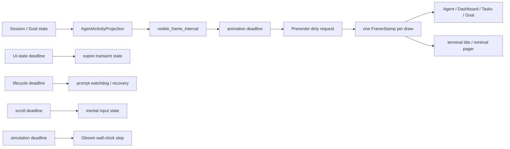

# Pager Motion 与 Deadline 架构

Pager 的动画是纯展示，不是 session 生命周期的时钟。一次 draw 在入口捕获一个
`FrameStamp { now, wall_now, elapsed }`，Agent、Dashboard、Tasks、Goal、terminal title 与
minimal surface 都消费同一份时间样本。spinner、wave、pulse 的相位由 elapsed 和
固定 `Duration` 纯计算；`wall_now` 只服务于来自持久 wall-clock 时间戳的年龄显示。
配置 FPS 只限制最大重绘频率，不改变动画速度。

## 相互独立的调度时钟

前台等待工具或子 Agent 时的 parked 状态只收起运行显示，仍显示
`AgentSession::live_status` 中的模型等控制反馈。实时反馈优先于后台任务提示，
终态清除后恢复原提示及任务点击区；模型仍由 Shell 在 Step 边界提交。
见 [等待期间的控制反馈契约](../../openspec/specs/client-surfaces/spec.md#requirement-parked-foreground-waits-preserve-live-control-feedback)。

- `animation_deadline` 只把 Presenter 标记为 dirty，不修改业务状态。
- `ui_state_deadline` 只处理绝对过期时间。toast、Todo
  badge、finish flash、Behavior banner 与延迟通知都有明确 deadline；静态展示只在
  到期时重绘一次。Dashboard 相对年龄、Idle freshness、删除确认和 leader-key 也各自
  声明下一次真实变化的 deadline。Behavior banner 仅在最后的淡出窗口请求动画帧。
- `lifecycle_deadline` 只负责 prompt status watchdog。它可以产生查询 effect，但不能
  吞掉同时到期的 animation repaint。
- `scroll_deadline` 只推进滚轮/触控板输入状态。
- `simulation_deadline` 只为 Gboom 一类真正的模拟器推进 wall-clock step；它不借用
  motion phase，也不进入 UI expiry reducer。

`GROW_SCROLL_LOG` 是滚动状态机的单向诊断记录器。显式文件目标在首条记录时延迟打开，确认是普通文件后取得非阻塞独占锁，再截断并写入；另一个 Grow 进程即使用路径别名指向同一文件也会停用自己的记录器，不会改写当前捕获。所有权随打开的文件句柄释放。行为契约见 [scroll log writer ownership](../../openspec/specs/client-surfaces/spec.md#requirement-explicit-scroll-log-paths-have-exclusive-writer-ownership)。

所有周期 deadline 都对齐到 AppView 的共同 origin 的下一个严格未来边界，不能用
`now + interval` 反复续期。持续 ACP 流在每个有界 batch 前领取已到期 deadline，
因此 motion 延迟上界是一个采样周期加一个 batch；writer 正忙时 Presenter 继续合并
dirty，不建立第二个 frame scheduler。

## 单向 Activity Projection

`AgentActivityProjection` 是从 foreground、needs-input、Goal、watcher/bg task、
workflow 与 subagent 状态即时派生的非持久化只读投影。Agent 页、Dashboard、状态栏、
title 和 visible frame demand 共用它。parked 只改变显示形式，不能把真实 running
foreground 投影成 idle；Active Goal 即使 foreground idle 仍是 Working。

投影绝不能反向写 session，也不能根据“是否正在绘制”刷新 liveness。prompt event 和
Running status 的时间戳只在 ACP/session reducer 中更新；服务端 `turn_started_at` 只
用于显示耗时。watchdog 每个静默窗口最多一个 in-flight 查询，Running 响应以本地接收
时间重新武装下一窗口，terminal 仍走唯一 first-wins finalizer。

## 可见 demand 与完成事件

只有当前可见、且像素会随时间变化的内容返回 `visible_frame_interval()`。隐藏 child、
静态 idle 页和有明确 deadline 的倒计时状态不产生 frame wakeup；再次可见时直接根据
当前时间得到正确相位，不补播历史帧。扩展页 loading/pending、inline media loading、
Goal stage 与 subagent wait 都是显式 demand，不依赖 foreground Running 猜测。

文件、history、scrollback 搜索、inline media 读取/解码、edit 全文件高亮与 Mermaid 渲染
都由后台 worker 发布 snapshot 后触发单一 async-view wake edge；event loop 在 UI 线程
一次性领取所有已完成 snapshot。Tracing 已有独立 channel arm，同样不借任何 clock。
Inline-media loader 限制为进程内两个 worker、每个 AgentView 两个 pending path，并将输入与
准备后的单图字节限制为 16 MiB；行为要求记录在
[当前 change](../../openspec/changes/bound-inline-media-loader/specs/client-surfaces/spec.md)。
这个 edge 会合并 burst，但不充当 frame clock，也不经过 `ui_state_deadline`。modal image
viewer 继续通过 Effect/TaskResult 回送，并用 overlay owner id 丢弃关闭或替换后的迟到
结果。

Mermaid flowchart 的静态解析、分组边预算与失败回退遵循
[client-surfaces 规范](../../openspec/specs/client-surfaces/spec.md#requirement-flowchart-class-annotations-preserve-node-meaning)。
这个解析预算在 worker 的源码大小、期限和像素限制之前检查；worker 只发布完整 PNG。

Scrollback 搜索提交只保留一份待扫描的最新 query 与 corpus 更新，通知队列容量为一；快速输入不会按键数积累后台请求。关闭搜索时停止标记优先于待扫描请求，worker 在扫描中核对停止标记并自然退出，UI 不等待线程 join。结果仍按请求代次和 query 双重核对，旧扫描不能覆盖当前搜索。

文件模糊搜索的重扫模式与最新 query 同样合并为一份待处理状态，并通过单槽非阻塞通知唤醒 worker。搜索关闭或切换目录时，UI 标记停止和取消旧 walk 后直接返回；matcher 与 walk 由 worker 自己收尾，UI 不在 Drop 中等待文件系统扫描。结果保留提交时分配的 query ID；Pager 下拉列表和 Workspace 状态通知都按该 ID 拒绝旧结果，合并跳过的 generation 不会让最新状态一直等待。

History search uses the same one-slot pending state and nonblocking Drop edge. Drop sets a worker-visible stop flag before queuing Stop; scoring and highlight collection check it between entries and abandon partial results. One nucleo score, highlight-index calculation, or current sort can finish after Drop, so cancellation has no wall-clock deadline. The history worker contract is recorded in [client surfaces](../../openspec/specs/client-surfaces/spec.md#requirement-history-search-submission-does-not-wait-for-worker-capacity).

## 持久化边界

`FrameStamp`、所有 deadline、activity projection 和 liveness 查询租约都不序列化。
session/Goal reload 只恢复业务状态；motion origin、可见 demand 与 deadline 从当前
单调时钟重建。因此系统休眠、隐藏页面或 session 重载都不会产生补帧、旧 spinner
counter 或跨会话 watchdog 污染。

后台完成通道同样是 session-coupled transient state。进入 replay 时必须切断 inline
media、edit highlight、Mermaid action 与 scrollback search 的旧 runtime，并清空旧
transcript 派生的 media byte/path cache；fork 采用新 cwd 时同时重建 file-search root。
edit block 在旧 transcript 被暂存前先从 `Pending` 归一化为 `HunkOnly`。worker 可以在后台
自然退出或写完纯缓存，但它的晚到结果不得修改新 scrollback，也不得执行旧会话的打开、
复制或 toast 动作。

## 不变量

1. 同一 draw 的所有 surface 使用同一个 `FrameStamp`。
2. ACP/input/task 事件数量不能改变 motion 相位或 terminal title 速度。
3. render 不修改 session、Goal 或 liveness 字段。
4. hidden/static view 不制造 animation deadline。
5. animation、UI state、lifecycle、scroll 与 simulation 同时到期时分别结算，互不短路。
6. FPS 变化只改变采样上限，不改变语义动画周期。
7. 后台资源完成只能通过 completion edge/effect 唤醒，禁止借 animation 或 UI expiry 轮询。
