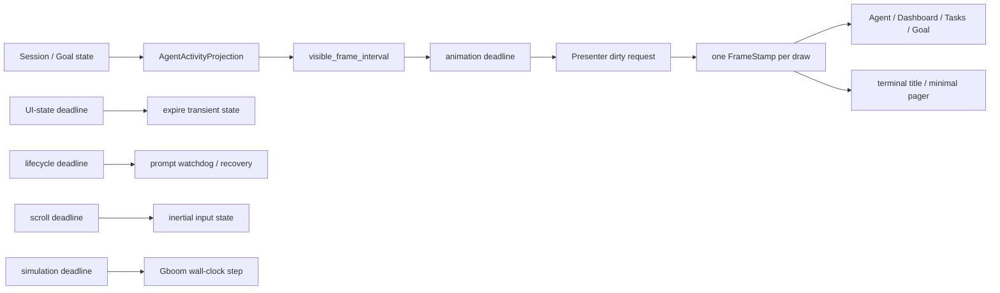

# Pager Motion 与 Deadline 架构

Pager 的动画是纯展示，不是 session 生命周期的时钟。一次 draw 在入口捕获一个
`FrameStamp { now, elapsed }`，Agent、Dashboard、Tasks、Goal、terminal title 与
minimal surface 都消费同一份时间样本。spinner、wave、pulse 的相位由 elapsed 和
固定 `Duration` 纯计算；配置 FPS 只限制最大重绘频率，不改变动画速度。

## 相互独立的调度时钟

- `animation_deadline` 只把 Presenter 标记为 dirty，不修改业务状态。
- `ui_state_deadline` 处理绝对过期时间和仍待事件化的轻量 UI reducer。toast、Todo
  badge、finish flash、Behavior banner 与延迟通知都有明确 deadline；静态展示只在
  到期时重绘一次。Behavior banner 仅在最后的淡出窗口请求动画帧。
- `lifecycle_deadline` 只负责 prompt status watchdog。它可以产生查询 effect，但不能
  吞掉同时到期的 animation repaint。
- `scroll_deadline` 只推进滚轮/触控板输入状态。
- `simulation_deadline` 只为 Gboom 一类真正的模拟器推进 wall-clock step；它不借用
  motion phase，也不进入 UI expiry reducer。

所有周期 deadline 都对齐到 AppView 的共同 origin 的下一个严格未来边界，不能用
`now + interval` 反复续期。持续 ACP 流在每个有界 batch 前领取已到期 deadline，
因此 motion 延迟上界是一个采样周期加一个 batch；writer 正忙时 Presenter 继续合并
dirty，不建立第二个 frame scheduler。

## 单向 Activity Projection

`AgentActivityProjection` 是从 foreground、needs-input、Goal、watcher/bg task、
workflow 与 subagent 状态即时派生的非持久化只读投影。Agent 页、Dashboard、状态栏、
title 和 visible frame demand 共用它。parked 只改变显示形式，不能把真实 running
foreground 投影成 idle；Active Goal 即使 foreground idle 仍是 Working。

投影绝不能反向写 session，也不能根据“是否正在绘制”刷新 liveness。prompt event 和
Running status 的时间戳只在 ACP/session reducer 中更新；服务端 `turn_started_at` 只
用于显示耗时。watchdog 每个静默窗口最多一个 in-flight 查询，Running 响应以本地接收
时间重新武装下一窗口，terminal 仍走唯一 first-wins finalizer。

## 可见 demand 与完成事件

只有当前可见、且像素会随时间变化的内容返回 `visible_frame_interval()`。隐藏 child、
静态 idle 页和纯倒计时状态不产生 frame wakeup；再次可见时直接根据当前时间得到正确
相位，不补播历史帧。文件搜索等尚需 reducer 轮询的状态只使用 UI clock；image viewer
加载已通过 Effect/TaskResult 完成通道回送，并用 overlay owner id 丢弃关闭或替换后的
迟到结果。

## 持久化边界

`FrameStamp`、所有 deadline、activity projection 和 liveness 查询租约都不序列化。
session/Goal reload 只恢复业务状态；motion origin、可见 demand 与 deadline 从当前
单调时钟重建。因此系统休眠、隐藏页面或 session 重载都不会产生补帧、旧 spinner
counter 或跨会话 watchdog 污染。

## 不变量

1. 同一 draw 的所有 surface 使用同一个 `FrameStamp`。
2. ACP/input/task 事件数量不能改变 motion 相位或 terminal title 速度。
3. render 不修改 session、Goal 或 liveness 字段。
4. hidden/static view 不制造 animation deadline。
5. animation、UI state、lifecycle、scroll 与 simulation 同时到期时分别结算，互不短路。
6. FPS 变化只改变采样上限，不改变语义动画周期。
