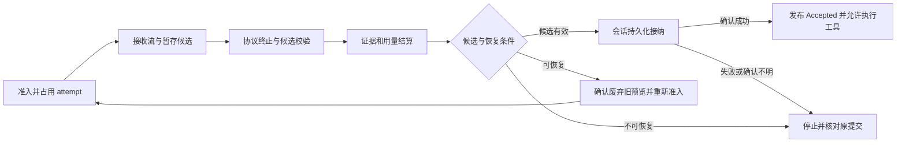

# 采样 attempt 的接纳与恢复

当前结论：把一次采样当作一个有接纳边界的 attempt。失败后能不能再发请求，需要同时看失败原因、输出去向、用量结算和请求所有权。这里的“事务”只描述 Grow 本地的接纳边界，不表示能够回滚远端推理费用或远端工具副作用。

状态：已实现、验证并归档到正式规范。证据与限制见 [verification.md](verification.md)。

## Context

已经有不少正确的基础，不需要重建框架：

- `sampler/src/actor/request_task.rs::run_request_task` 已持有请求快照，逐 attempt 收集结果，等待 evidence 与 usage ACK 后才决定重试。
- `shell/src/session/actor/turn/mod.rs` 先 `push_response_durably`，之后才可能派发工具。失败 attempt 的 tool delta 本身不执行工具。
- `chat-state` 的 Timeline 是事实源，delta 只用于传输；Goal 已有逐 attempt 准入、所有者 epoch 和独立结算路径。

缺口集中在这些边界没有被同一套语义表达出来：

| 修改前实现 | 对恢复的影响 |
| --- | --- |
| 三协议把缺少结束证据和身份冲突都包装成 Serialization | 无输出的瞬时截流也立即失败；不能整体放开 Serialization |
| `output_observed` 在整个请求上保持 sticky，错误特例可以绕过它 | 无法表达上一轮已废弃、这一轮能否重试；副作用边界依赖错误种类 |
| 内部 L2 Completed、sampler Completed、Timeline 接纳分属不同阶段 | “流完成”容易被误当成“响应已提交”；持久化失败不能重新推理 |
| delta 只有 RequestId；shell 转通知时丢掉此身份；Retrying 不撤销预览 | 新旧 attempt 的文本、reasoning、tool index 可能串在一起 |
| Goal 在 usage sink 逐次结算，普通账本/子任务输出量在最终成功或失败路径更新 | 被内部恢复吞掉的失败 attempt 没有同样的账本投影；scope=None 分支还会直接跳过该 sink 的业务更新 |
| doom、普通 retry、session 的语义修复分别计数 | 单独看都有上限，组合后的总调用次数仍缺少共同上限 |

表中的用量问题是已读取路径的静态发现，不声称已通过线上账单或完整 session 故障注入证明实际漏计金额。

## Goals / Non-Goals

目标是统一三个协议和主/子 agent 的恢复判定，并让每个决定可复现、可计费、可取消。主/子 agent 的模型步骤共享恢复内核，允许不同的输出交付能力和预算约束。辅助 Sideband 保留既有独立 attempt、证据和预算所有者；底层三协议的错误事实共用，本次不把辅助调用改成主循环消费，也不为其新增自动恢复。

不以“所有错误都能自动恢复”为目标。确定性输入/协议错误、未知外部副作用、持久化确认不明必须有明确停止分支。合法 length、content filter、pause_turn 等依旧是语义结果；不把它们当断流重新执行同一请求。

## Decisions

### 1. 区分逻辑采样、真实 attempt 和已接纳响应

一个逻辑采样从某个已确认的上下文投影开始，到一个响应被接纳或明确终止为止。自动重新采样产生新 attempt，不产生新的用户输入，也不应偷偷重置恢复预算。

复用 RequestId 和已有 attempt 序号作为归属键，不再创建一套 UUID 服务。这个归属键不依赖 Goal 是否存在；可选 Goal scope 仅是计费归属。session 需要修复输入时保留逻辑采样的恢复额度，记录新的请求修订及其原因；route snapshot、source projection 和 owner epoch 必须仍明确。

同输入重新采样继续使用原快照，禁止把半截文本/tool JSON 塞回输入。凭据刷新、清空 native continuation、图片降级和 compaction 会改变输入或认证，继续由 session 执行，完成持久化确认后再提交。sampler 不获取修改会话历史的权力。

### 2. 错误说明发生了什么，策略决定怎么处理

在现有错误类型中表达下列语义，并保留结构化 backend、阶段、结束原因、缺失的完成证据和原始错误来源。具体 Rust 名字在实现时收敛，不要求每行都成为一个新 struct。

| 事实类别 | 例子 | 基础处置 |
| --- | --- | --- |
| 暂时性传输/服务失败 | connect reset、429、明确可恢复的 5xx | 同输入有界重试，遵循服务端 veto/Retry-After |
| 响应尚未完整 | EOF 缺 terminal、未完成前 idle timeout | 丢弃该候选，具备恢复条件时同输入重新采样 |
| 完整但无效的生成 | 已完整封装的非法工具 JSON、空生成、可信 doom-loop | 整个候选废弃，在较小分类上限内重新采样 |
| 确定性协议违例 | response/tool 身份冲突、非法索引、已关闭 item 又变更、未知结构不符合当前协议 | 停止并保留证据，不靠重新采样隐藏适配问题 |
| 请求状态需要修复 | 认证、明确的 native rejection、图片能力拒绝、上下文超限 | 返回 session 做有依据的状态转换，再走同一准入边界 |
| 本地生命周期失败 | cancel、owner 失效、账本/证据/提交失败、内部事件流消失 | 停止；不能伪装成远端断流后重新采样 |

流结束方式也要保留：`[DONE]`、正常 body EOF、transport error、idle timeout、provider terminal、local cancel。此前 Chat 的 `[DONE]` 和正常 EOF 都变成 None，事后不能从这一层区分。实现已在既有流结束结果/attempt evidence 上保留原因，没有给每条 raw chunk 再包一层协议。

EOF 不是完成证据，JSON 能解析也不是完成证据。相反，已收到合法完成证据后只缺可选 usage 尾帧，不应重新生成答案；结算可以是不完整，不能从缺 usage 推断缺正文。保留 Chat 已有的有界 usage tail。

Messages 已积累的协议矛盾不能被最终 EOF 覆盖成可重试错误。完整 envelope 的坏工具参数与 EOF 导致的半截参数也要区分。Chat/Messages 的完整坏参数接入与 Responses 一致的生成结果校验；完整性、身份校验优先于“生成可重试”。

不再把 `SamplingError -> SamplingErrorInfo -> SamplingError` 当内部决策路径。内部使用保留原因与上下文的失败结果，序列化只发生在诊断/通知边界；不可直接 Clone 的原始 HTTP/JSON 错误由 Arc 持有，再投影给消费者。外部 DTO 不决定本地重试资格。

### 3. 输出能否撤销由交付路径决定

不能统一假设“delta 都只是预览”。Grow 自己的 Pager 可以实现撤销，但 `--include-partial-messages` 已向 stdout 输出的标准流无法收回；第三方 ACP 消费者也不一定理解 attempt 废弃。

请求提交时确定输出交付能力：

- **只收最终结果**：候选可直接丢弃，前提是工具/远端副作用和计费允许。
- **支持 attempt 废弃的预览**：每条 text、reasoning、tool delta、signature 和聚合缓存都带归属；先关闭旧 attempt，再发布新 attempt。
- **不可撤销的输出**：第一次向该消费者发布可见响应内容/协议帧后，禁止透明重新采样。可以明确选择缓冲到接纳后输出，但不能同时承诺标准实时流和无感撤销。

存在多个消费者时采用最严格能力；中途接入不支持撤销的消费者不能把旧输出视为可撤销。实现复用 leader 的路由边界：对明确 Retractable 的候选，支持生命周期的消费者实时接收预览，未知观察者先缓冲，到 Accepted 后再交付；Discarded 直接丢弃。缓冲本身使这些观察者的有效交付能力为 Buffered。发起 headless/未知客户端的会话保留 Irreversible 实时流，不因路由适配改变其 stdout 协议或延迟到最终答案。能力由显式 per-session metadata 声明，子任务继承父会话能力，禁止依据全局 client_type 猜测。首个外发帧是保守不可逆边界，不能只看 FirstToken：Messages 的 ResponseStarted、signature 等也可能已经外发。

预览事件的生命周期是 Begin → Delta* → Discard 或 Accepted。扩展现有事件/通知，沿同一 FIFO 管道传递；Discard 必须越过合并/debounce 队列的顺序屏障，不能像普通低频诊断一样直接旁路。新 attempt 不复用旧工具 index 的累积内容，旧 attempt 的迟到事件不能污染新输出。

Pager Fullscreen/Inline 可移除临时活动块并重绘；Minimal 已 finalized 的块可能进入不可撤回的 terminal native scrollback，所以明确使用不可撤销交付。能力在终端探测返回实际 ScreenMode 后设置。headless 默认遵守自身协议能力，不能给标准 Messages 流凭空添加自定义 abort 帧。

本地工具仍只在响应 durable admission 后执行。若路由包含可产生副作用的 provider 托管工具，未收到结果不等于工具未执行；必须有明确的重放安全证明才允许自动重新采样。未知就停止，不承诺远端 exactly-once。

#### 回放边界补充

`emit_buffered` 把 ACP preview 和 Grow attempt 边界送入同一 persistence 队列。`SessionPersistence` 复用现有所有者，暂存当前 attempt 的 ACP 候选；候选开始后交错到达的独立 ACP 也保留在同一个有序窗口。`Accepted` 按原队列顺序写出全部内容；`Discarded`、新 attempt、停止或 owner drop 只写出独立内容，丢弃候选。边界作为控制信号，不写成第二份历史。`updates.jsonl` 是回放缓存，Timeline 仍是响应接纳事实源。

leader 对未知观察者同样按原顺序缓存候选窗口中的普通 session 通知，避免独立通知的更大 eventId 先到而跳过被延后的候选。带 JSON-RPC id 的权限、文件和终端请求继续按原路由即时处理，不进入候选缓冲；定向 load 回放也绕过实时候选 reducer。

客户端断线可能错过 Discarded 或 Accepted。若 Pager 留有未确认预览，重连不能只以最后收到的 eventId 继续尾部：该水位可能来自交错的独立事件。根视图强制使用完整的已接纳回放；即使回放为空，也不合回旧候选。子视图沿用现有控制和路由身份，在 root reload 窗口暂存受影响的 transcript/tracker；成功时仅去掉旧的未确认候选，保留独立内容和新到达的尾部，失败则恢复完整归属。主视图失败清理不能擦掉恢复的 preview 条目映射；live preview 早于 load completion 到达时，新候选的归属也必须跨过通用 turn cleanup。此处解决旧候选误显示为成功历史，不新增断线期间活跃候选的前缀补传协议。相应场景见 client-surfaces delta 和验证记录。

### 4. 每个 attempt 都先结算，再决定下一步

保留已有 evidence ACK 和独立 Goal settlement，把普通 prompt/session/model 统计及 TaskOutputTokenBudget 接到同一 attempt 结算入口。无 Goal 也需要 settlement 身份。成功、拒收、连接阶段取消、超时、doom 和非法参数都经过这条入口。

用量至少区分“已知”和“不完整”；在既有 attempt 记录上保留已知分量/下界和未知原因。不能把未知当零，不能把 observed token 估计冒充 provider 精确计费。现有 raw evidence 足以保留的部分不再重复建库存储。

各账本以 attempt 归属去重，逐项 ACK；不要求跨 actor 的分布式原子事务。部分结算成功或 ACK 丢失时保留未确认状态，关闭下一次准入；只允许核对/补交同一笔结算，不能为了恢复账本再调用模型。重放和 parent usage fold 不能二次增加子任务消费。

响应接纳以后，`record_response_token_usage` 保留上下文压力锚点、成功响应指标等职责，移除已经由 attempt 结算完成的消费累计。context anchor 来自被接纳响应，计费总额来自所有真实 attempt，两者不能混用。

预算策略沿用现有含义：无精确预算时可记录用量不完整后继续有界恢复；精确 Goal/子任务预算下未知消费关闭准入。已知消费则先扣除，下一 attempt 的输出上限重新夹到剩余额度，不能一边扣账一边仍 clone 原来更大的 token grant。语义输入快照不变不等于预算许可不变。

### 5. 统一执行入口，保留状态所有者

恢复判定可以收敛为一个无 I/O 的函数，输入失败事实、输出状态、结算/所有者状态和剩余额度，返回停止、同输入重采样或 session 修复动作。Backoff、client rebuild 是同输入重试的参数，不另外建立可独立计数的循环。

```text
同输入重采样许可 =
    失败类型允许重新采样
    && 未接纳候选、无不明外部副作用
    && 输出未发布或可按 attempt 废弃
    && 上次证据和各用量结算已确认
    && 当前 owner/取消/预算准入仍有效
    && 逻辑采样的次数和期限均有剩余
```

sampler 持有真实 attempt 的执行循环，session 持有历史/认证等语义状态。共享的是恢复上下文及消费上限，不能把 session 塞进 sampler，也不能同时让两层对同一个失败各重试一次。

默认沿用普通配置的总 attempt 上限数值（当前通常为 5），其含义统一为总 attempts，包括第一次派发（本 change 不扩大为全产品配置字段迁移）；自动恢复关闭时仅初次请求，非法生成分类仍最多 3 次，429 等可有更低子上限。doom 同样消耗总额度，较低分类额度只会收紧上限。

分类额度耗尽后的 doom 行为需要表达为“停止主动重采样”，只允许在全局额度仍有余额时执行一次关闭检测的候选生成，并且它同样计入总额度；不能凭空多一次调用或把已丢弃的候选重新标成成功。保留已有接受策略的意义，而不是绕过总上限。

同一步骤的 native reset、认证恢复等重提交不重置总额度。真正接纳一个语义结果后，后续工具步骤/合法 length 续写是新步骤，但仍受原 turn/Goal 生命周期和取消约束。用户新输入/steering 通过 owner epoch 关闭旧链，允许新链。

次数之外保留一个逻辑采样的绝对期限：继承调用者更早的期限；普通会话默认使用原 idle_timeout × max_attempts 作为粗上限，backoff 和 provider polling 都计入，同一链不重新起表。超时只取消模型活动和后续准入，不能硬切断有独立 owner 的用量结算。它不承诺不可中断本地 I/O 在期限内完成。

### 6. 完成证据、结算和 durable admission 是不同阶段



sampler 的完成结果仅表示候选完成且采样侧结算已处理，不能叫客户端把它当已接纳历史。session 的 durable admission 成功后才发最终 Accepted。接纳写入成功但确认丢失时，查询既有 Timeline/提交身份核对；本轮不新增跨进程自动恢复器。无法核对则停止并保留证据。

用户取消会阻止下一次 provider poll，不等于删除已发生消费。取消与 terminal 同时到达，保留已收到的用量；尚未提交的候选默认不再进入工具执行，已跨过 durable admission 的部分按已有停止/工具生命周期收尾，不能以重试回滚。

### 7. 诊断必须能回答为何没有恢复

沿既有 attempt evidence / Timeline 引用记录：逻辑请求和修订、attempt 序号、backend/provider request id（可得时）、终止方式、完成证据是否齐全、输出交付状态、结算状态、决策以及停止原因。恢复次数/耗时独立于最终候选延迟。

面向用户保留具体失败类型，不再让内部的 `serialization error` 充当缺少完成证据的解释。是否继续、停止约束和累计 attempt 数写入既有 attempt evidence，完整诊断不依赖 UI 文案反推策略；不为每次恢复加 toast，也不记录凭据。

## Risks / Trade-offs

- 可撤销输出带来的收益依赖整个投影链，不能只给 sampler 增加 AttemptId。头尾事件、merge、replay buffer、Pager、headless 必须一起验证后才开放输出后恢复。
- 更准确的用量结算可能更早停止带预算任务。这是执行真实约束，不应通过虚构精确 usage 恢复可用性。
- 严格身份/状态冲突仍会停止，供应商长期不符合协议时不会被自动恢复治好。应根据具体证据修适配器，不能引入全局宽松解析模式。
- 新状态应并入现有 request task、事件和账本。不要增加恢复 actor、重试队列、第二份历史或“通用事务”库。
- 当前仓库还有独立的父子消息改动；实施时复核新增 steering 路径的 epoch/取消接线，不混入父子消息功能实现。

## Migration Plan

已按 [tasks.md](tasks.md) 的四个垂直阶段实施，每阶段均有错误路径测试；最终验证范围和限制见 verification.md。

1. 错误事实与执行策略：三协议的不完整流统一，已有输出暂保守停止；内部决策脱离 DTO 文本重建。
2. 逐 attempt 结算与准入：覆盖所有账本、子任务余量和共享恢复预算，保留原有 owner fence。
3. attempt 预览与接纳：打通事件、合并、Pager/headless 和 Timeline 边界，按交付能力开放输出后恢复；同时替换非法参数/doom 的旁路。
4. 组合故障注入与开发者说明：三个协议、主/子任务、取消、ACK、崩溃证据与不可撤销输出都纳入验证。

运行时改动与验证进度以 tasks.md / verification.md 为准。

## Open Questions

没有需要猜测后才能选择安全默认值的产品决策：不能撤销的客户端保守停止，精确预算下未知用量停止，协议冲突停止。已核对实际消费者及 Sideband 调用入口，最终能力矩阵见 verification.md；未声明能力的入口不会自动获得更宽松策略。

当前报错的实际 provider、尾帧和是否已外发内容尚未取得，不影响以上共性设计，但影响事故根因归属。未据此判断代理有 bug。
