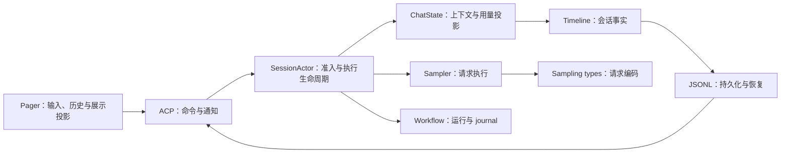

# Grow 全局架构审查与优化方案

审查日期：2026-09-12。状态：审查已完成，等待用户决策；以下实施批次尚未获得批准。

## 结论与范围

Grow 已有值得保留的架构主线：Timeline 记录会话事实，ChatState 负责模型上下文和用量投影，SessionActor 负责执行准入与生命周期，Pager 消费展示投影。当前主要问题集中在这些边界之间：恢复过程重复构造状态，部分恢复校验弱于实时校验，客户端异步结果缺少完整归属，底层协议类型仍拉入运行时依赖。

建议先处理用户能直接感知的 resume 和已确认的正确性缺口，再收敛依赖，最后按领域整理状态所有权。暂不全量重写、不按文件大小机械拆类、不增加通用事件框架或新的协调服务。

本轮以 HEAD `8489761bda66848484c58d059f91dfa9bfbf98ed` 加现有工作树为对象。开始时已有 61 个 tracked 文件修改和 4 个未跟踪的归档 change；这些内容均作为现状核对，没有回滚或修改。全局依赖覆盖 57 个 workspace member、197 条内部 normal dependency；深入核对会话恢复、采样与用量、控制准入、Workflow 恢复、Pager 投影及 CI。未逐行审阅全部代码，也未执行所有平台、Provider 和终端场景。

证据分三类：**动态复现**表示本轮实际执行；**源码确认**表示控制流或依赖已核对；**待测量**表示有明确热点，但未获得真实延迟占比。文件摘要、依赖清单和验证范围见 [evidence.json](evidence.json) 与 [verification.md](verification.md)。

## 现有所有权与优化方向

图表达主要职责与数据流，不是全部 crate 依赖。需要保留的约束：

- SessionActor 保持一个权威调度者；settling、持久化 ACK、控制边界和独立取消域不能因简化而合并。
- Timeline、Workflow journal、updates 展示记录具有不同职责。模型上下文、确定性执行凭据和 UI 历史不能互相冒充权威。
- 已有 lazy rewind、cursor replay、ACP 输入公平性、scrollback batch、元数据延迟加载都应继续使用。
- 正确性和性能问题分 change 收敛；文档审计归档不代表产品优化已实施。

## 1. P1：resume 的完整恢复与可交互时间

**现象来自用户：历史开始显示后，仍很久才加载完全，也迟迟不能输入或操作。**

### 当前执行链

1. `MvpAgent::load_session` 获取生命周期与 model reload gate；resident reconnect 先 flush，冷恢复获取 writer lease。
2. 两条路径都执行 `load_light`，完整读取、验证 Timeline，并计算控制、信号、Workflow 等投影。
3. 读取 updates snapshot，过滤 rewind/cursor，解析并逐条转发历史，等待 gateway completion，再补发 cutoff 后的增量。
4. 冷恢复随后重建 actor，再次从 events 构造 Timeline，并再次读取 updates 以恢复 durable control receipts。
5. 发布控制/协调状态，完成其他恢复收尾，冷恢复提交 usage resume boundary，最后返回 `LoadSessionResponse`。
6. Pager 收到完成结果后执行 `end_batch()`、清除 `loading_replay`、处理队列及子视图恢复。

因此，**第一条历史可见不等于会话恢复完成**。这一执行顺序能解释用户描述的阶段差；哪一步占用主要时间仍需测量。

源码证据：

- [load_session 主链](/Users/lordcasser/workspace/projects/grow/crates/codegen/shell/src/agent/mvp_agent/acp_agent.rs:636)、[历史回放](/Users/lordcasser/workspace/projects/grow/crates/codegen/shell/src/agent/mvp_agent/acp_agent.rs:1009)、[回放后冷恢复 actor](/Users/lordcasser/workspace/projects/grow/crates/codegen/shell/src/agent/mvp_agent/acp_agent.rs:1086)。
- [light load](/Users/lordcasser/workspace/projects/grow/crates/codegen/shell/src/session/storage/jsonl/mod.rs:272)、[actor 再构造 Timeline 及读取 receipts](/Users/lordcasser/workspace/projects/grow/crates/codegen/shell/src/session/actor/spawn.rs:853)。
- [读取和发送 replay](/Users/lordcasser/workspace/projects/grow/crates/codegen/shell/src/agent/mvp_agent/mod.rs:1011)、[Pager 完成加载](/Users/lordcasser/workspace/projects/grow/crates/codegen/pager/src/app/root/dispatch/session/load.rs:558)。

### 已确认的重复工作与限制

| 路径 | 源码确认 | 优化切入点 |
| --- | --- | --- |
| 冷恢复 Timeline | storage 已构造 validated Timeline；bootstrap 传回 events，actor 再次 `from_events`，并 clone Timeline 和 surface | 在现有 bootstrap/loaded-data 边界转移已验证状态的所有权，避免重复 fold；保持入口身份、artifact 与 sideband 校验 |
| 冷恢复 updates | UI replay 完整读取后，actor 为控制终态恢复再次完整读取 | 在同一已验证 committed snapshot 中提取 replay 和 receipts 所需信息；保留 cutoff 增量与终态一致性 |
| resident reconnect | 跳过 actor 重建，但仍完整观察加载 Timeline | 后续评估从 resident owner 获取一致快照；owner 退出时必须重新获取写者资格并恢复，不复用失效快照 |
| replay transport | 先为所有保留行创建 completion receivers，再统一 drain | 测量队列峰值、处理/发送/等待分别耗时；必要时改成有界窗口，保持消息顺序和 response barrier |
| Pager 回放结束 | `end_batch()` 同步重建 turns 并使布局缓存失效 | 测量收尾、第一次完整布局和子视图恢复；避免把长时间同步任务集中在最后一帧 |

需要纠正的直觉：Pager 已按最多 32 条 ACP 消息批处理，并在有键盘/滚轮输入时停止 ACP drain；也已有批量插入避免每次 `push` 都重建 turns。不能把问题归结为“没有批处理/输入一直被 ACP 抢占”。不过单次 handler、布局或收尾的同步耗时仍可能阻塞输入。`loading_replay` 明确阻止队列 drain，并不是所有键盘操作的统一禁用开关。

对应证据：[事件循环](/Users/lordcasser/workspace/projects/grow/crates/codegen/pager/src/app/root/event_loop.rs:1680)、[scrollback batch](/Users/lordcasser/workspace/projects/grow/crates/codegen/pager/src/scrollback/state/mod.rs:648)、[queue gate](/Users/lordcasser/workspace/projects/grow/crates/codegen/pager/src/app/root/dispatch/queue.rs:384)。标题、prompt history、Agent 名称等已在 `handle_session_loaded` 中通过后续 Effect 加载；不能再次包装成新优化。

布局也已有虚拟化：[prepare_layout](/Users/lordcasser/workspace/projects/grow/crates/codegen/pager/src/scrollback/state/mod.rs:1806) 对全部 entries 建立廉价高度估算，仅对可见区域做精确测量，并预热附近页面；并非所有历史都执行完整 Markdown 布局。需分别测量全量估算、可见测量和预热，不能从 cache 失效直接推断主要耗时。

### 实施策略与验收

先复用 [session_load_perf](/Users/lordcasser/workspace/projects/grow/crates/codegen/shell/tests/session_load_perf.rs:1) 和已有 instrumentation，补齐 Pager 的可交互计时。现有 `session.replay.read_and_filter` timer 在原始 snapshot 读取之后才开始，名字不能替代实际计时覆盖；需把读取与过滤分别标注。测试使用小型合成会话和受限大样本，不默认复制用户真实会话。

记录 `T_first_history`、`T_input_echo`、`T_load_response`、`T_full_history`，以及 Timeline 读/验证/fold、updates 读/过滤/发送/drain、actor bootstrap、控制 ACK、Pager handler/布局/终端写入各阶段。区分 cold resume、resident reconnect、cursor 命中/回退、长文本、密集工具消息和多子会话；统计 wall time、RSS、临时磁盘和重复解析次数。

第一步优先消除冷恢复中已确认的重复 fold/读取，再根据测量选择最慢的 UI 阶段。交互契约区分“本地编辑和浏览”与“提交执行”：加载期间草稿编辑、滚动、退出应及时响应；提交必须等权威恢复状态就绪，明确显示待恢复状态且只接纳一次。不能仅提前清空 `loading_replay` 来制造完成假象。

建议验收门槛：固定机器和数据集上，回放期间输入到回显 p95 ≤ 100 ms；完整恢复时间相对批准后的基线有可重复改善，重复 fold/全量读取次数减少；历史无丢失、重复和错序；resume boundary、controls、正在运行的 turn、queued input、replay cutoff 与加载失败回退均保持正确。100 ms 是拟议 UX 目标，当前尚未实测，不承诺未测得的加速倍数。若优化未改善测得瓶颈，不继续增加缓存层。

## 2. P1：用量结算的实时与恢复校验不一致

**动态复现，存在规范偏差。** 实时 `record_subagent_usage` 会比较同一子 Agent 的结算并拒绝冲突；恢复时 `usage_from_timeline` 对 JSON decode 失败直接跳过，对已有 settlement id 也直接跳过，没有检查载荷一致。

本轮 probe 使用真实 ChatState API、内存 Timeline 和 NullTimelinePersistence，无 Provider 请求：

| 情况 | 实际结果 |
| --- | --- |
| 实时首次结算 input=3 | 接受 |
| 实时相同 child 再结算 input=30 | `SubagentUsageConflict` |
| 恢复两份完全相同结算 | 接受且只计一次，符合去重预期 |
| 恢复同 child 的 3 与 30 两份冲突结算 | 接受，仅保留 3，`incomplete=false` |
| 恢复格式损坏的结算 | 接受，用量为 0，`incomplete=false` |

证据：[恢复 fold](/Users/lordcasser/workspace/projects/grow/crates/codegen/chat-state/src/actor/state.rs:306)、[实时冲突判定](/Users/lordcasser/workspace/projects/grow/crates/codegen/chat-state/src/actor/mutations.rs:591)、[契约：Session usage is a durable lifetime projection](/Users/lordcasser/workspace/projects/grow/openspec/specs/session-timeline/spec.md)、[probe 源码](usage-restore-probe.rs)、[实际输出](usage-restore-probe-output.txt)。

修复方向：已知用量事实共用 typed decode、身份匹配与冲突检查，实时与恢复执行同一校验规则。合法重复只计一次；冲突失败关闭；损坏的已知权威事实报告错误，保留原记录。普通未知 Observation 仍可作为扩展诊断事件，不把所有 Observation 强行封闭。核对 attempt、child、incomplete、resume boundary 各类记录后再实现。

验收覆盖 live/replay 对照、合法重复、冲突、字段损坏、归属、分段汇总和失败时文件不变。该复现是注入异常持久化记录后的恢复行为，不证明现有正常 writer 会自行生成冲突，也不等同于 Goal 预算绕过。

## 3. P1：Context 异步结果在归属检查前修改 live state

**源码确认的控制流缺口，未做 UI 动态复现。** `ShowContextInfo` 发请求时持有 session id，但 `ContextInfoComplete` 只传回 AgentId、info、nonce。handler 先调用 `apply_full_context_info`，之后才判断 modal nonce。关闭重开弹窗后，旧结果虽然不进入新弹窗，仍可能覆盖当前 live context；重新绑定同一 AgentView 时也缺少 session 身份校验。

证据：[Effect 丢弃 session 身份](/Users/lordcasser/workspace/projects/grow/crates/codegen/pager/src/app/root/effects/mod.rs:2984)、[先修改后检查](/Users/lordcasser/workspace/projects/grow/crates/codegen/pager/src/app/root/dispatch/status.rs:335)。旁边 Usage、SessionInfo 和 rewind read 已有更完整的身份/版本校验，可复用设计经验。

修复方向：把 session binding、请求目的及必要的请求序号贯穿 Effect → TaskResult → reducer，任何状态写入前先检查有效性。优先使用已有 `session_binding_epoch`，不要为每个 tab 新造独立生命周期体系。root/child 诊断路由作为独立后续事项处理。

验收：关闭重开、同 AgentId 换 session、旧请求后到、失败后到、当前请求正常返回；同时断言 modal 与 live context。不能只检查弹窗内容。

## 4. P1：观察读取会隐式进入投影修复和写者准入

**源码确认、条件触发；backlog 已有记录，本轮复核。** `load_light_data(..., false)` 使用 observation handle，之后仍调用 title/model reconcile；Summary 落后于有效 Timeline 时会尝试持久化修复。若独立读者遇到正在运行的 writer 或无写权限目录，就可能在纯读取目的下争取 writer lease 并失败。

证据：[观察加载及 reconcile](/Users/lordcasser/workspace/projects/grow/crates/codegen/shell/src/session/storage/jsonl/mod.rs:272)、[title/model 修复](/Users/lordcasser/workspace/projects/grow/crates/codegen/shell/src/session/storage/jsonl/mod.rs:2788)。已有 Windows shared-read 修复并未消除这一条件窗口；不应把“读取句柄可共存”扩大为“所有读取路径无写副作用”。

修复方向：Summary 的内存派生与磁盘修复分离。观察者返回从权威事实派生的投影；显式 writer restore 才拥有 repair。相同或更新序号上的冲突继续报错，不把损坏统一当成可修复滞后。

验收：live writer + lagging title/model、无写权限观察者、正常 writer takeover、投影已一致、投影冲突，以及失败时无意外写入。该项独立变更，不能在 resume 优化中顺手放宽存储校验。

## 5. P1：目标后端的工具关联 ID 编码不是单射

**源码确认，需特殊输入触发；backlog 已登记。** Messages 编码器把非 alphanumeric/`_`/`-` 字符替换为 `_`，所以 `a.b` 与 `a/b` 都变为 `a_b`。相应 call/result 各自编码，无法保持不同调用的唯一关联。实现还使用 Unicode `is_alphanumeric`，与旁边注释的 ASCII 字符集合不一致。

证据：[sanitize_tool_call_id](/Users/lordcasser/workspace/projects/grow/crates/codegen/sampling-types/src/conversation.rs:4075)。本轮未新发 Provider 请求，不主张已观测到线上后端拒绝。

修复方向：在单个目标请求内建立稳定、合法、无碰撞的 call/result 映射，统一覆盖 native 与 portable 部分；不改 Timeline 原始身份，保留 continuation 语义。与更广的请求投影整理拆开实施。

验收：标点碰撞、已有下划线 ID、Unicode、长 ID、跨 native/portable 的冲突、工具调用与结果配对、跨后端与压缩后的历史。目标后端的长度/字符约束需在实施时核对当前官方契约。

## 6. P2：基础协议与运行时依赖方向

**依赖与调用方已核对。** 数字是 manifest 内部可达集合，包含 optional 边，不是二进制大小或编译耗时。

| crate | 内部直接 / 传递依赖数 | 具体问题 | 最小优化方向 |
| --- | --- | --- | --- |
| sampling-types | 2 / 10 | 协议层引用 tools 的 Definition、FunctionTool、ModelImageInputKey | 纯 tool schema 优先放已有 tool-types；model image key 单独核对真实所有者，不能简单搬入杂物 types |
| grow-http | 5 / 28 | HTTP client 引用 workspace::ClientType；还有 sampler::OriginClientInfo | 产品标识由组合入口传入中性值；OriginClientInfo 的方向单独处理，不盲目制造新 crate |
| pager-render | 10 / 28 | permission cursor 仅为特殊 option 判断引用 workspace | 调用方提供语义，renderer 只渲染；权限规则保留唯一所有者 |
| update | 4 / 40 | 更新模块经 shell util 读写配置、解析版本策略 | grow_home 已属于 config，直接使用；将必要更新配置读写与 VersionPolicy 收到 config，保留配置原文与环境覆盖语义 |

证据：[sampling-types 类型入口](/Users/lordcasser/workspace/projects/grow/crates/codegen/sampling-types/src/types.rs:294)、[tool definition](/Users/lordcasser/workspace/projects/grow/crates/codegen/tools/src/types/definition.rs:8)、[HTTP client](/Users/lordcasser/workspace/projects/grow/crates/codegen/grow-http/src/lib.rs:29)、[permission cursor](/Users/lordcasser/workspace/projects/grow/crates/codegen/pager-render/src/appearance/permission_cursor.rs:19)、[config 路径所有者](/Users/lordcasser/workspace/projects/grow/crates/codegen/config/src/paths.rs:30)、[update 调用方](/Users/lordcasser/workspace/projects/grow/crates/codegen/update/src/auto_update.rs:96)。

验收按每条边分别做：行为不变、Cargo 图中目标反向依赖消失、相关消费者编译通过、配置/权限/请求契约测试通过。先完成这些有证据的小边界，再决定是否新增实体。依赖检查复用 cargo metadata，在现有 CI 加少量禁止边断言即可，无需建设新的治理平台。

## 7. P2：请求投影有多个消费入口，需收敛语义

`request_builder` 构造 source_projection、模型前缀和证据跨度；ChatState 的估算又遍历 source spans；后端编码器还通过 request segments 解释输入。已有共享 `portable_prefix_end`，不能说完全没有公共规则。风险在于边界修改后，模型真正收到的内容、token 估算和证据解释可能不同步。

证据：[请求构造](/Users/lordcasser/workspace/projects/grow/crates/codegen/chat-state/src/actor/request_builder.rs:128)、[估算入口](/Users/lordcasser/workspace/projects/grow/crates/codegen/chat-state/src/actor/state.rs:83)、[request_segments](/Users/lordcasser/workspace/projects/grow/crates/codegen/sampling-types/src/conversation.rs:1630)。

策略：先明确不可变请求投影/segment 的共同契约，让编码、估算和证据使用相同的 segment 遍历和后端路由；允许各自消费不同字段。不因大文件而建立通用 Provider 插件框架，也不把存储 Timeline 直接当 wire request。验收基于跨后端六方向、compaction、reasoning replay、工具配对和真实编码结果，不只做结构快照。

## 8. P2：Workflow 恢复筛选与遗忘的事实边界

**源码确认、backlog 已记录。** Workflow 恢复先截取最近 128 个 Spawned run id，再检查 cleared、目录和资产有效性。较新的 cleared/不可恢复候选会消耗名额，可能挤掉较早仍有效的 run。当前 clear 主要靠 sidecar tombstone，Timeline 保留 Spawned；Sidecar 丢失时，生命周期和可恢复资产之间的解释仍需要明确。

证据：[候选截断早于有效性筛选](/Users/lordcasser/workspace/projects/grow/crates/codegen/shell/src/session/storage/jsonl/mod.rs:2556)、[clear tombstone](/Users/lordcasser/workspace/projects/grow/crates/codegen/shell/src/session/workflow/store.rs:652)。有效 manifest 可保留进度，fallback 主要由 Timeline seed/lifecycle 恢复，不应把它描述为完整进度恢复。

策略分步：先使 cap 针对最终可恢复集合，覆盖新 cleared run 挤占旧有效 run；再独立设计持久 Forgotten 事实和进度 fold/checkpoint。Workflow journal 继续负责确定性外部调用顺序及请求哈希，Timeline 负责所属会话中的生命周期。不要把两个账本合并。

## 9. P2：状态封装与在线 append 成本，排在事实一致性之后

SessionActor 约 124 个声明字段，AppView 约 117 个，包含条件编译字段；这是定位跨域访问的线索，不是拆分的充分理由。已有 ForegroundState、AdmissionState、TaskSlot 和领域模块，优先沿这些边界收紧访问、让一个领域的方法负责自己的 prepare/commit/publish 与 teardown。暂不将 SessionActor 拆成多个互相发消息的 actor。

另一个独立热点：`Timeline::prepare` 与 `accept` 都执行验证，验证 clone 生命周期 fold，历史集合越大，在线 append 越贵。**批量恢复已使用 `accept_replayed` 避免旧的二次方 clone 问题**，不能将已修复的冷恢复问题再次列为新缺陷。在线路径需单独测量，并保持持久化失败后的内存原子性。

证据：[SessionActor](/Users/lordcasser/workspace/projects/grow/crates/codegen/shell/src/session/actor/mod.rs:1462)、[Timeline prepare](/Users/lordcasser/workspace/projects/grow/crates/codegen/chat-state/src/timeline.rs:2911)、[在线 validate](/Users/lordcasser/workspace/projects/grow/crates/codegen/chat-state/src/timeline.rs:3293)。

## 实施批次与停止条件

| 批次 | 独立 change 范围 | 验收与停止条件 |
| --- | --- | --- |
| 第一批，建议批准 | A1 resume 基线与冷恢复重复工作；A2 按实测热点优化回放交互；A3 用量恢复冲突校验；A4 Context 异步归属 | 各 change 独立验证、独立提交；A2 依赖 A1；没有测量依据时不扩大性能改造；恢复和接纳契约不放宽 |
| 第二批 | B1 observation/repair 分离；B2 工具 ID 无碰撞编码；B3 逐条消除基础反向依赖 | 每条边/每个行为独立 change；请求与存储失败场景不丢失；不顺带搬整个配置系统 |
| 第三批 | C1 Workflow 筛选与遗忘；C2 请求投影共同语义；C3 有证据的领域封装及在线 append 优化 | 前两批稳定后再启动；每项重新确认范围与收益；禁止将全部债务捆绑为一次重写 |

第一批是可独立交付的四个变更，并非一个大提交。A1/A2 由主 agent 负责跨层设计；低成本 subagent 可承担固定依赖核对、测试样本矩阵整理和范围清晰的机械修改。用户批准后才建立产品 change 的 proposal、delta specs（WHEN/THEN）、design、tasks；本审计不提前修改主规范。

## 验证与磁盘预算

本轮 `cargo check --locked -p cli` 通过；ChatState、Sampling types、Sampler、Workflow 共 **1062 passed / 1 ignored**。额外用量 probe 复现上述差异。库测试通过并不能覆盖该缺失场景，也不能证明真实终端 resume 已达性能目标。

现有 CI 有核心库回归、跨平台 local coordination、Windows storage 和构建/发布 smoke；没有发现 PTY resume 性能场景进入常规 CI。仓库已有 `session_load_perf`、session load RSS 测试和 PTY harness，应优先接入这些已有设施。先选一个小型确定性恢复/交互 smoke，再给受限大样本设专用性能任务，避免把全部 ignored PTY 测试塞入每次 PR。

审计期间 Data 卷约剩余 87 GiB，target 约 6.2 GiB；这是观察值，非新增占用。收到磁盘提醒后停止新增 Cargo 构建，后续 probe 复用已有 rlib。本轮保留文本证据，删除自建临时 probe 与中间文件；不清理用户的 target、其他工作树或会话。

实施建议继续共享现有 target，编译串行，先记录磁盘基线；性能样本显式限制尺寸，临时目录由测试所有权回收，不同时运行多份大样本。初始预算建议合成测试新增磁盘 ≤ 256 MiB、可用空间低于 20 GiB 时停止重型测试并报告；这些是拟议工作预算，不是当前产品限制。
