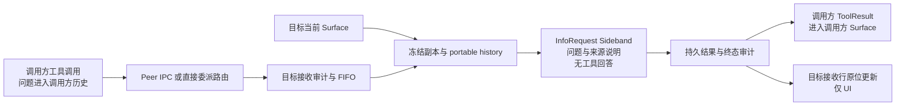
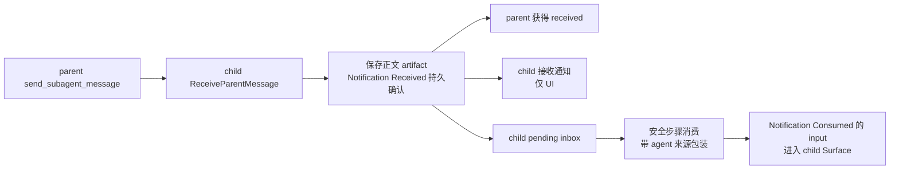

# 跨 Session agent 交互管线

这里的“进上下文”指进入某个 Session 后续主采样使用的 `Surface`。需要同时说明是哪一个 Session：询问不进入目标主 Surface，但回答会作为调用方的工具结果进入调用方 Surface。InfoRequest Sideband 自己也有完整的模型输入，不能把“旁路执行”理解成“没有上下文”。

分析基线是 2026-09-22 当前工作树，包含已有未提交改动。本文保留实施前管线基线；本变更的双向意见和特殊结果见 [exchange-design.md](exchange-design.md)，实现验收以 verification.md 为准。下文是源码核对结果；本轮没有启动真实 Session，也没有运行 Rust 回归。源码位置以函数名为稳定入口，现有并行改动可能移动行号。

## 按数据而非显示形式分类

| 数据或操作 | 调用方主上下文 | 接收方主上下文 | 独立执行 / 持久化 / 展示 |
| --- | --- | --- | --- |
| `list_active_sessions` | agent 调用时，工具参数与返回列表进入上下文 | 无目标输入 | 读取在线 primary discovery，不读取对方完整对话 |
| `ask_session` | 工具调用的问题，以及返回的 answer / error 进入上下文 | 问题与回答均不进入 | 目标当前 Surface 的冻结副本 + 来源说明 + 问题 → InfoRequest Sideband；双端有 inquiry 审计 |
| `ask_parent` / `ask_subagent` | 同上 | 同上 | 直接委派关系授权，汇入同一个 inquiry 执行入口 |
| `get_inquiry` | 显式调用的查询结果进入上下文；其中可能包含已有回答 | 不进入 | 查询缓存或已验证 Timeline，不重新回答 |
| inquiry phase / approval / cancellation / receiving row | 通知本身不进入；工具最终返回的错误/状态属于工具结果 | 不进入 | phase 是进度；接收、审批、终态是审计；UI 是相应投影 |
| `send_subagent_message` | 原工具参数与接收回执/错误进入父上下文 | 原文经 inbox 消费后进入 child；仅 `Received` 时尚未进入 | 仅 parent → 直接拥有且正在接受干预的 child；不走 InfoRequest |
| child 的父消息收件 `UiNotice` | 无新增输入 | UI notice 本身不进入 | 从同一 `Notification::Received` 投影，不产生第二次模型消费 |
| 子任务实时 `SubagentProgress` | 不进入 | child 原工作有自己的上下文 | 工具次数、turn 数、用量等 transient UI 数据 |
| 子任务完成正文 | 阻塞调用/显式取结果时作为工具结果进入；需自动交付时经 `SubagentCompleted` receipt 消费进入 | child 的结果来自其自身执行历史 | `SubagentFinished` UI 更新本身不等于父模型收到结果 |
| 另一 Agent 的完整内部对话 | 不自动复制 | 不自动复制 | inquiry 只让目标 Sideband 读自己的冻结 Surface，返回所需答案；新 child 的初始上下文继承是另一个入口 |

表中的“调用方进入上下文”限定为 **agent 发起工具调用**。通过 ACP extension 直接调用协调 API 时，结果交给 API 调用方；API 响应不凭空成为来源 Session 的模型消息。`Notification` 也有两种不同对象：durable inbox 事件和前端 `SessionNotification`，不能只凭名称判断可见性。

## 1. 询问：读取目标上下文，不写入目标主对话

`ask_session` 先在来源 Timeline 持久化 `OutgoingStarted`，再经本机 discovery、握手和 IPC 寻址。parent-child 的 ask 由 coordinator 校验直接所有权，通过 Session command 路由，无需 peer discovery。两条路径最终都进入 `SessionActor::enqueue_coordination_inquiry`。

目标先确认接收事实，再入 FIFO，最多 32 个等待项、一个 inquiry 执行项。出队处理时一次物化 Surface 和 `input_ref`；**冻结发生在跨工作区审批之前**，审批等待期间产生的新进展不会补入这次回答。同 cwd 或直接委派可放行，其他 cwd 沿用已有单次 UI 审批。前台忙碌不是拒绝条件。

`project_portable_history` 保留可配对的已完成工具证据及附件，包括尾部连续工具交换；未返回的工具调用从独立请求投影中省略。来源完整对话不跨进程传入，Sideband 的额外输入是问题与运行时来源说明。回答不能执行工具、推进目标任务或作权限授予。

回答由 Sideband ledger 保存，目标追加 terminal inquiry audit 后返回来源；来源保存 `OutgoingCompleted`。经 agent 工具调用时，普通 tool-result 提交路径将返回正文放进调用方 Surface。目标主 Surface 没有对应追加；目标 TUI 看到的问答是接收审计的投影。

两端事实与可恢复显示分别由原 Timeline 和 UI cache 持有，`updates.jsonl` 不是事实权威。同 ID / 同 payload 可复用，冲突拒绝；peer 重连固定原 incarnation，目标换进程不会自动作为新任务再问一次。冷恢复关闭未完成 inquiry，不能显示成回答成功。

代码入口：

- `crates/codegen/tools/src/implementations/grow_build/coordination.rs` — `AskSessionTool::run`、`GetInquiryTool::run`。
- `crates/codegen/shell/src/agent/mvp_agent/coordination.rs` — `SessionCoordinationBackend::ask_with_id`。
- `crates/codegen/shell/src/agent/mvp_agent/subagent_coordinator/interaction.rs` — `ask`。
- `crates/codegen/shell/src/session/actor/coordination.rs` — `enqueue_coordination_inquiry`、`handle_coordination_inquiry`、`persist_coordination_inquiry`。
- `crates/codegen/shell/src/coordination/inquiry.rs` — `InquiryEvent::timeline_kind`，固定为 `Observation(coordination/inquiry)`。
- `crates/codegen/shell/src/session/actor/tool/result.rs` — `handle_bridge_tool_success`，`ConversationItem::tool_result` → `push_tool_result`。

## 2. 父消息：接收和消费是两个时间点

`interrupt=false` 不取消当前模型请求，消息在后续安全步骤消费。`interrupt=true` 在接收事实提交后请求安全抢占模型采样或可中断等待；不可中断工具结果仍须收敛。两种模式都先接收、后消费，不能从工具 `received` 推断目标已经采样、理解或执行。

正文 artifact 保存原文。消费时附加 `Message from delegating agent ... This is agent guidance, not new human authorization.`，通过 notification 输入进入 Surface。child 收件 UI 则直接投影原文，用 receipt identity 去重，不触发新的人类输入、第二次 Notification hook 或第二次消费。

接收 ACK 丢失或发送后取消时，实际 receipt 可能已经持久化，来源应显示“投递状态未知”。恢复保留未消费 inbox 和已接收历史；已消费仅删除 pending 状态，不能删除收件显示需要的原文引用。

代码入口：

- `crates/codegen/tools/src/implementations/grow_build/task/interaction.rs` — `AgentInteraction::Send`、`interact`。
- `crates/codegen/shell/src/agent/mvp_agent/subagent_coordinator/interaction.rs` — `run`，只将 durable ACK 解释为 `received`。
- `crates/codegen/shell/src/session/actor/notification_drain.rs` — `receive_parent_message`、`receive_notification`、`notification_blocks`、`drain_active_notifications_excluding`、`publish_parent_message_receipts`。
- `crates/codegen/chat-state/src/timeline.rs` — `apply_validated_event`；`Notification::Consumed { input: Some(_) }` 追加 Surface，`Received` 只更新 inbox projection。

## 3. 子任务结果与进度

child 的实时统计通过 `spawn_progress_publisher` 发往前端，不放入父 Surface。子任务完成首先有自己的结果与父 Timeline terminal，然后按交付方式进入父上下文：阻塞 `task` / `get_task_output` 返回 ToolResult，或从 durable `SubagentCompleted` receipt 生成通知输入。

如果工具结果已经暴露该结果，`acknowledge_consumed_notifications` 用 `Consumed { input: None }` 关闭对应收据，不再追加一条同正文通知。这个 `None` 是消费关联，不意味着结果从未进入模型。

代码入口：`crates/codegen/shell/src/agent/subagent/mod.rs` — `spawn_progress_publisher`、`admit_notification_receipt`、`repair_subagent_completion_receipt`；`crates/codegen/tools/src/implementations/grow_build/task/mod.rs` 的完成返回；`crates/codegen/shell/src/session/actor/tool/result.rs` — `acknowledge_consumed_notifications`。

## 哪些判断不能从界面反推

- `Answered` 只表示 Sideband 回答完成，不表示目标主 Agent 接受了新任务。
- `Received` 只表示 durable inbox 收件，不表示消息已经消费。
- Timeline 有记录，不等于 Surface 有对应模型输入；`Observation`、Sideband 生命周期和 UI cache 都不能自动转成 prompt。
- 父视图可以展示 child 的进度，但父模型不会因此拥有 child 的全部内部历史。
- Sideband 是执行方式，不能作为所有目的的统一可见性规则。本文讨论的是 inquiry 的 `InfoRequest`；压缩、图片描述等 Sideband 结果有各自明确的提交入口，不在本次改动范围。

## 已有验证入口与关联问题

已有测试明确覆盖 `inquiry_preserves_completed_tool_evidence_on_all_backends`、`delegated_inquiry_during_foreground_bypasses_peer_approval_without_injecting_input`、`parent_intervention_is_durable_attributed_and_has_explicit_timing`、`parent_receipt_publication_is_transient_and_recovers_after_ui_disconnect`；`scripts/test_local_coordination.py` 覆盖真实双进程、busy/FIFO/dedup/reconnect。它们是实施时的回归入口，本轮只阅读，没有声称重新跑过。

现有规范与上述主要投影边界一致，本轮未确认新的运行时偏差。已知 `fix-sideband-consumed-surface-validation` 已于 2026-09-22 独立归档，处理 consumed-input/notification 坐标的严格加载误拒；不要把该问题解释为必须等待目标 foreground idle。现有 backlog 已登记 passive coordination row 与普通工具渲染耦合，本次只复用正文渲染，不顺带引入新 row 类型或重构整套 tracker。
