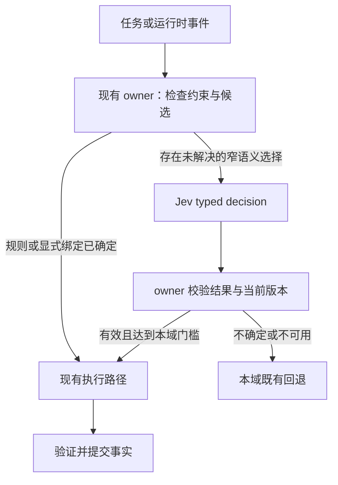

# Jev 接入 Grow：模型选择、记忆、压缩与授权

这次改造的目标是减少昂贵模型的调用、重复输入和无效等待。Jev 只处理已经形成输入、候选和边界的语义判断；规划、调查、代码生成、摘要生成仍由 LLM 完成，资源、依赖、权限上限和提交条件由代码检查。

状态：设计提议，尚未实施。代码核对对象是 HEAD `3024dad1` 之上的当前工作副本，包含任务开始前已有的未提交修改；不是纯 HEAD 快照。资料核对日期为 2026-09-22，关键文件指纹见验证记录。本 change 归档只表示方案交付完成，不表示下述运行时能力已经上线。

## 1. 从现有实现出发

| 范围 | 当前实际入口与行为 | 接入判断 |
| --- | --- | --- |
| 模型与 effort | `shell/src/agent/subagent/handle_request.rs` 已解析模型、校验 effort、锁定 resume 来源；普通 `fork_context` 固定父模型。`actor/model_switch.rs` 通过持久事件提交模型变化。 | 优先路由新建且具有独立上下文的 child。fork、resume、Workflow 已冻结 route 不进入自由重选。 |
| Memory 读取 | `actor/turn/mod.rs::first_turn_memory_reminder` 首次注入时检索；已有 typed memory context 不重复注入。`memory/src/search.rs` 合并 FTS/向量结果，支持降级与限额。 | 不能把每次便宜检索都改成先调用 Jev。仅在候选噪声和注入开销足够大时增加筛选。 |
| Memory 写入 | `actor/memory_dream.rs::run_memory_flush` 冻结输入、选最近窗口，调用生成模型，再做内容校验和去重；支持指定 flush model。 | 在生成前判断是否存在值得提取的新增信息，能够跳过整次 flush 生成。Jev 不生成 Markdown 记忆。 |
| 压缩 | `actor/compaction.rs` 已有 model-free pre-prune、软水位后台摘要、硬水位恢复、冻结选区和 Step 边界提交。 | 保留现有确定性省计算路径。Jev 主要选择可选摘要时机与生成档位，不能接管超窗判断。 |
| 授权 | `workspace/src/permission/auto_mode.rs::PermissionClassifier` 是现有接口；manager 先处理规则与权限边界。child 仅部分 locked call / shell 风险升级进入 Auto 判断，常规围栏内调用已有快路径。 | 替换 eligible classifier 中的生成式判断，有可测的整次调用替代收益。不能在所有工具调用前追加 Jev。 |
| 子任务授权输入 | `actor/turn/sampling.rs::child_permission_judgment_items_from_evidence` 使用真实用户输入，排除模型、工具与 synthetic 摘要作为授权来源；child 判断当前使用主模型，但 effort 来自独立 classifier 策略。 | 已经是独立 side query，不需要主 agent 再输出一次派发。收益应归因为替换 side query，不能声称消除了原本不存在的主会话回合。 |

此处路径相对于 `crates/codegen/`，表中 `actor/` 缩写为 `shell/src/session/actor/`。Atlas scoped search 用于定位，局部 call closure 没有覆盖全部调用方；上述链路同时通过源码调用点核对，不将空 callers 当作“没有调用”。

普通 fork 固定父模型、resume 的完整 route 校验、child classifier 的模型与 effort 选择，目前主要由实现表达，相关主规范没有完整描述这三项。这是本方案需要显式处理的文档覆盖边界，不据此推断运行时缺陷；后续行为 change 应补齐所触及的场景。

相关行为权威是 [model-sampling](../../../specs/model-sampling/spec.md)、[memory-search](../../../specs/memory-search/spec.md)、[context-compaction](../../../specs/context-compaction/spec.md)、[tool-authorization](../../../specs/tool-authorization/spec.md)、[session-timeline](../../../specs/session-timeline/spec.md) 和 [workflow-execution](../../../specs/workflow-execution/spec.md)。这些链接按本设计的归档位置解析。

现有 `fix-sideband-consumed-surface-validation`、`reconcile-response-replay-projection` change 正在处理相邻的证据与回放边界，后续实现必须重新核对其落地状态。这里只复用它们已经明确的权威归属，不顺带重构回放或修复旁支问题。

## 2. 最小架构



一个共享 Jev client，四个由现有模块持有的策略调用点即可。不要建立新的中心调度 agent、通用 DAG 引擎、记忆数据库或权限服务。

主 agent 创建任务时一次性说明目标、输入、修改范围、验收条件和必要依赖。执行配置已经明确时直接使用；只有留给运行时的 `auto` 选择才进入 Jev。依赖就绪、并发容量、写入所有权和任务认领继续由已有运行时检查。依赖信息不足时返回主 agent 修订，Jev 不能证明两项任务不存在耦合。

在现有任务/Workflow 支持的状态流转内，完成事件可以解锁已声明的工作，不增加一次“主 agent 调 Jev → 再回复派发”的往返。自然语言任务没有表达出机器可执行依赖时，不能凭这个方案就宣称支持完全自动的乱序调度；扩展 Workflow 是独立需求。

### 2.1 接口只统一传输与证据

Jev 官方接口为 `state + model + questions → answers + usage`，支持 `Choice`、`Noul`、`Score`。一个请求中的问题独立读取同一 state，不能消费同批其他答案。[官方接口说明](https://docs.typesafe.ai/introduction)、[Choice](https://docs.typesafe.ai/primitives/choice)。

共享请求元数据只需要：

```text
purpose
owner/session identity + source revision
question/policy version + candidate-set digest
bounded state + source references + truncation markers
deadline + cancellation + input budget
```

输出保留 typed value、完整概率分布、可用的 confidence、实际 Jev model version、usage 与错误类别。随后各域转换为自己的枚举，不用一个通用 `allow` 覆盖全部语义：

| 域 | 建议输出 |
| --- | --- |
| Route | `profile_id / defer` |
| Memory | `extract / skip / uncertain`；候选关系可另用 `relevant / duplicate / conflicting / uncertain` |
| Compaction | `keep / summarize_standard / summarize_deep / uncertain`，只限代码已经允许的选项 |
| Authorization | `within_scope / outside_scope / insufficient_evidence`，再交给既有 Gate 决策 |

`defer/uncertain` 是真实候选，不能让系统在信息不足时被迫挑一个执行动作。API 成功也要检查答案完整性、候选 ID、数值范围与 schema；typed 输出不等于语义正确。

`confidence` 是从分布形状计算的统计值，并非这个代码库上某次判断正确的概率。各域门槛必须由 Grow 的标注和回放确定，不共用一个 `0.9`。Noul 没有同名 confidence 字段。[官方 confidence 说明](https://docs.typesafe.ai/confidence)。

### 2.2 放进现有运行时

- 在 shell 增加窄范围 decision 模块，组合 Jev HTTP client、冻结输入和取消/超时；workspace 的 permission 模块继续通过 trait 接收结果，不引用 shell。
- Jev 的专用协议不伪装成 Chat Completions，也不作为可生成代码的普通 chat model 进入主模型候选。
- 复用 Timeline/Sideband 的来源、attempt、取消与用量结算。当前 Sideband 请求记录具有生成式请求假设，需要在真正接入时增加最小 typed decision 请求/结果表示和目的类别，并写对应 delta；不能声称“现有 Sideband 已原样支持 Jev”。
- 实际影响 route、授权或 Surface 的决定需要可追溯：来源 revision、候选与策略版本、采用值、回退原因及消费位置。普通模型上下文不自动追加所有 decision 记录。
- 同一 revision 的独立判断可合批，但不为凑批拖延关键调用。内存整理不能挤占工具授权的延迟预算；调用队列有并发和长度上限。
- Jev 不可用时按域回退；持久化确认失败不能当成普通模型超时继续执行。前者遵守原有 fail-closed 提交边界。

候选缓存以输入、策略、候选与模型版本组成的 key 失效。任务版本、用户授权、模型目录或 transport 变化后重新校验。授权判断缓存绝不代替一次性 permit。

## 3. 模型与 effort：选合法执行配置

模型与 effort 应一起成为候选配置。例如 `small+high`、`standard+medium`、`frontier+high` 是三种具体执行方式，先从 Grow 当前模型目录生成，再过滤不支持的组合。名字仅作说明，不硬编码供应商，也不假设不同模型的 `high` 等价。

### 3.1 一次选择的输入

直接使用已有任务卡、最新用户要求、已验证的事实及少量运行时指标：目标与验收、局部/跨模块范围、未知条件、必要模态和工具、输入大小、已有失败、deadline/预算、可复用上下文。不要为了填这些字段额外调用大模型总结全历史；未知字段保留 unknown。

候选过滤顺序：

1. 用户显式选择、项目明确规则、任务既有有效绑定优先。只开放尚未固定的维度；不支持的显式组合明确报错。
2. 校验模型是否可用、effort 是否支持、工具/模态能力、输入窗口和数据可发送范围。
3. 保留足够覆盖困难任务的候选；相同模型同等配置只剩不同空闲实例时由代码分配。
4. 针对固定任务，让 Jev 判断哪些配置具备足够能力；代码结合实测成本、队列和上下文复用选择配置。不让 Jev 凭模型名猜测延迟与价格。
5. 提交前重新校验目录版本、任务版本和容量，并在现有 admission 边界认领。

初版可以对少量候选分别问“给定输入和验收，配置 P 是否足以完成这个有界任务”，并独立输出分布；代码按本域验证过的阈值选成本最低的合格候选。也可用一个联合 `Choice(profile_id, defer)`，但候选描述必须包含能力和已测表现。

不要在同批请求里问“选哪个模型”和“刚选中的模型用什么 effort”：第二问看不到第一问的结果。若使用两阶段选择，明确承认额外网络往返。

### 3.2 路由粒度与升级

| 时点 | 建议 |
| --- | --- |
| 新建独立 child | 第一落点；选一次后在该工作单元内保持。 |
| 普通 full-context fork | 先保留父模型和缓存局部性；现有代码会固定父模型。跨模型 fork 另写契约，不偷偷覆盖。 |
| resume / 已准入 Workflow Run | 使用原 route snapshot；不能因 Jev 重选破坏来源身份。 |
| 主会话 | 后期支持 `auto`，仅在新 turn 或明确闭合的阶段边界重评；显式 pin 保持优先。 |
| 生成进行中、工具往返未闭合 | 不切换。 |
| 验证失败或出现新架构未知 | 先分清环境/前提错误与能力不足；只有后者升级模型或 effort。 |

升级不是把每一次测试失败都送到最大模型。重试应保留证据、预算和停止条件；写入或外部工具已执行时不能盲目重跑整个 child。路由只改变之后的采样，工具的重执行由原执行协议决定。

模型切换会影响 context window、native continuation、缓存和输入重放；通过现有 model-change owner 提交完整 provider/model/backend/effort/transport 快照。为小模型强行压缩长上下文可能更慢，也可能丢信息，因此总成本必须包括上下文搬运与切换损耗。

评估对象是 `生成 + 验证 + 返工 + 升级 + 切换` 的完整任务成本。短期沿用静态规则与离线评测表，不先增加在线训练系统。

## 4. Memory：先减少无效写入，再控制读取量

长期记忆与当前任务状态要分开：跨会话偏好、稳定架构约束、已经确认的经验适合 memory；本轮正在做什么、谁持有写入权、某个工具是否执行过，仍从 Timeline/任务运行时恢复。

### 4.1 写入路径

```text
现有 flush 触发
  → 冻结“上次已处理之后”的证据范围
  → 无新增内容/精确重复：代码跳过
  → Jev：是否有新增且可复用的信息？
      ├─ 高把握无新增：跳过本次生成
      ├─ 有新增：现有 LLM 提取 → 校验/去重 → 写入
      └─ 不确定/失败：沿现有提取路径
```

先只接自动 idle/pre-compaction flush；用户明确 `/flush` 或要求记住内容时不让分类器静默否决。Jev 能选择“是否提取”“属于何种候选关系”，不能产出或验证任意新事实。

稳定标识应绑定真实输入范围，不能只依赖 `flush_count`。跳过决定只消费该冻结范围：之后有新输入必须再次有机会处理；同一范围也不能每个 Step 反复问一次。采用决定和输入进度要与现有状态 owner 一致提交，失败不能凭空推进游标。

门控必须检查实际将被提取的同一范围。若为了预算只给 Jev 局部预览，结果不足以跳过其余未读内容；范围缩小或内容截断必须显式标记并走提取回退，不能把“预览没有发现新信息”扩大成“整个增量没有信息”。

记忆内容保留来源、适用 workspace、时间和验证状态；source metadata 可以在现有 Markdown 格式和索引投影中扩展，不另立事实库。Jev 判断冲突时保留原内容与矛盾候选，由现有整理流程或 agent 检查；相似度高不能自动证明旧事实已失效。自动升为全局记忆需要额外依据，不能因为它“看起来通用”。

Dream/rewrite 先保留；等 flush 门控收益成立后，再用新增内容范围筛选待整理材料。不能对同一段内容依次做多轮分类、生成、再分类而没有明确收益。

### 4.2 读取路径

沿用 FTS/embedding 召回、来源过滤、MMR 和结果限额。首版不在每个 prompt 前加 Jev 检索开关，因为本地查询可能比远程分类更便宜。

需要评估的第二步是候选精排：在召回内容将占用较大输入预算时，用 Jev 对候选的任务相关性作判断，再由代码按 token 预算选择。候选少或已有有效绑定时直接使用；失败回退原有排序。显式用户记忆、硬约束和明确引用的条目不因低相关性被静默丢弃。

保留现有 typed memory context 的恢复和去重边界，不在 resume 时重新检索覆盖历史注入。memory 内容作为带来源的资料进入模型，不能变成工具授权凭据。

## 5. 上下文压缩：控制可选生成，保留完整证据

Grow 已经有无模型 pre-prune，能够直接避免部分摘要调用。这个收益归属于现有代码基线；Jev 的增量收益必须在它之后测。

第一版只扩展软水位策略：

```text
token/窗口/输出预算检查
  → 现有 pre-prune
  → 仍需处理？
      ├─ 硬水位：现有有界压缩/超窗恢复
      └─ 软水位：Jev 选择继续保留，或启动标准/深度摘要
```

Jev 输入是已形成的任务与历史信息：是否出现阶段边界、旧范围是否仍有待解决事项、近期内容类型、增量大小及合法策略。不要为这个判断先生成一份 LLM 摘要。输入证据不足则执行现有策略。

软水位 `keep` 有有效期限，只能延后可选工作，不能越过下一次硬预算检查。接近硬水位时不再等待 Jev，确保可用于摘要的窗口、输出和误差余量。最终发送前仍按完整请求（含工具 schema）测量，而不是只看历史正文。

Jev 可以为 LLM 摘要选档，不能生成摘要。原文的保护与替换由 ChatState 掌握：

- 保留当前用户目标、仍有效的约束、未完成工具往返和必要 tail；引用的工具证据不能只保留工具名。
- 摘要输入覆盖范围必须与 replacement target 一致。不能只挑“重要几行”送模型，却替换整段没送进去的历史。
- 冻结输入，提交时复查 authority、model 和 revision；取消或 rewind 后的迟到结果丢弃。
- 保持 portable 工具配对、native epoch 重置、既有 AutoContinue 和完成通知规则。
- 原始 Timeline 可回查；恢复详细证据的原路径继续存在。授权判断不从压缩摘要恢复用户许可。

逐片段语义删除、任意重排历史和新的 hot/warm/cold 存储层暂不引入。已有 Timeline、Surface、memory 足够表达这次范围。

## 6. 授权：替换判断调用，许可仍由 Gate 签发

授权是四项里最需要窄输入、明确失效条件的一项。语义上有用、工具风险低、用户已授权是不同命题；Jev 的高 confidence 不能把前两项变成第三项。

推荐保持现有入口次序，只在确定允许使用 Auto classifier 的位置插入 Jev：

```text
冻结实际 tool identity + arguments + cwd
  → deny / immutable capability ceiling / descriptor review / managed Ask 等边界
  → 既有确定性快路径
  → eligible Auto：Jev 窄语义判断
      ├─ 在可自动处理类别内，明确满足已有授权：原 Gate 签发 exact-call permit
      ├─ 证据不足、输出无效或超时：原 LLM classifier
      └─ 明确冲突：按原 deny/复核路径处理
  → dispatch 再校验身份与 epoch，消费一次性 permit
```

首轮只记录 Jev shadow 结果，现有 classifier 继续决定。之后只放开经过专项评测的有限 Auto 类别。外部发布、受保护操作或明确需要用户确认的类别仍沿原规则；Jev 不修改 `Ask`、`deny` 或能力上限。

### 6.1 可用的授权证据

使用已有 typed 输入和许可记录构造只读投影：真实用户要求、明确许可/限制及其原始 ID、冻结工具调用、策略版本、child 身份、出生能力上限、cwd 与资源身份。新的用户撤销或范围变化使旧投影失效。

assistant 计划、子任务描述、工具结果、网页、memory、摘要、AutoContinue 都不能成为“用户同意”的来源。任务描述只帮助解释必要性，工具文本只作为待判断数据。无需每次发送整段会话，但投影缺信息时必须回查真实来源或回退，不能把截断当成已经完整审查。

大 `write` 的预览和 digest 只能证明正在审查同一参数，不能证明未展示正文安全。初版这类不完整内容不进入 Jev 自动 allow；保留既有精确审查路径。未知 shell 继续保守投影 RWX；不能依据 Jev 觉得“只读”放宽代码推导出的权限需求。

不把自然语言解析为一张自动生效的宽泛“用户授权表”。可持久化的许可仍由现有 manager 管理。若以后要让用户表达跨工具的长期范围授权，应作为单独接口与安全契约设计。

### 6.2 避免重复确认的机制

已经由确定性规则和明确许可覆盖的调用直接通过，不调用 Jev。需要语义解释的调用只对冻结动作判定一次，结果交给 Gate。若需要人工确认，在原工具预检和可审查操作材料准备完成后请求，原因引用实际策略或缺失证据，不以“模型不太确定”创造新审批类别。

同一个授权材料可以支持多个独立判定，但不能共享已经消费的 permit。批准后工具名、参数 hash、cwd、授权 epoch 或 MCP transport generation 变化，原 permit 必须失效。child 也不能通过 `ask_parent` 回复扩大不可委派能力。

Jev 只输出固定判断，解释可以由规则码、证据 ID 和模板组成；没有必要再花一次 LLM 调用“把 allow 润色成原因”。无法用现有证据解释的许可不进入自动路径。

## 7. 四项如何协作

以“主 agent 已明确接口，委派一个局部实现任务”为例：

1. 主 agent 在原规划响应中说明输入、范围、依赖和验收。若已指定模型/effort，代码直接使用；否则 runtime 对新建独立 child 做路由。
2. 子任务读取项目资料；memory 原检索路径召回历史约束。只有注入负担明显时才做精排。
3. child 提出工具调用。代码快路径覆盖普通动作，只有 eligible Auto 请求才交给 Jev，必要时进入原 classifier。
4. 长任务进入软水位，先 pre-prune，再判断是否值得提前摘要；硬预算始终控制最终请求。
5. 返回实现与验证证据，由主 agent/既有验收工作采用；失败不能由 Jev 投票成成功。只有新增且可复用的信息才触发后续记忆提取。

每项收益的来源不同：路由降低生成与返工总成本；memory 减少生成与后续无关输入；压缩降低可选摘要次数和阻塞时间；授权替换已有 side query。它们不会自动相加，可能争用网络、失去缓存或增加回退。

分支预测暂缓。若之后引入，只允许在已声明候选、预算和失效条件内做只读调查或隔离准备；结果仍是假设材料，不能解除依赖、扩大权限或代替验收。

## 8. 用什么证明有收益

先测量现状，不把供应商的单请求演示速度当作 Grow 加速比例。官方也注明短输入有利于演示，工作流评估使用强模型共识作为参考，公开倍数处于实际收益的高端范围。[发布说明及评测限制](https://typesafe.ai/blog/introducing-system-one-models-and-jev)。

对能够跳过昂贵调用的门控，一个简化收益条件是：

```text
预期净节省 = 跳过概率 × 被替代调用成本
           − Jev 与输入准备成本
           − 新增回退、误判修复和缓存损失
```

上述成本可以分别按费用与延迟计算；并行系统的交付时间要看关键路径，不能把所有 side query 耗时相加当作用户等待。memory/压缩导致后续 token 变化时，比较完整会话而非单次请求。

保留三个对照：A 为当前实现，B 为只改规则/任务提示与快路径，C 为 B 加 Jev。后续逐域开关做消融，避免把代码优化和更好的任务拆分归功于 Jev。shadow 只能验证决定差异与单次成本，无法证明另一模型实际完成任务的反事实质量；模型路由需要隔离回放或受控实验。

| 域 | 必测收益 | 必测质量与回退 |
| --- | --- | --- |
| Routing | 完整任务费用、p50/p95 完成时间、主模型输入、切换成本 | 测试/评审通过率、返工与升级率、困难样本退化 |
| Memory | 跳过的 flush 生成、注入 token、后续重复检索 | 漏记关键事实、过时/冲突记忆、显式记忆保存 |
| Compaction | 摘要调用次数、阻塞时间、后续累计输入 | 任务继续率、约束/工具证据保留、超窗与取消恢复 |
| Authorization | 被替代 side query、工具等待 p95、重复确认次数 | 错误放行、错误拒绝、用户撤销、注入与过期 permit |

评测集按完整 session/project 切分，包含成功、模糊、冲突、未知命令、大内容和状态变化，不能随机拆同一会话的片段后声称泛化。权限边界类回归要求零绕过，抽样零错误不代表生产零风险；有限自动放行必须同时报告样本量、覆盖类别和错误率区间。

阈值与启用类别在实现 change 中根据基线确定。未满足本域质量门槛，或新增开销吞掉收益，就保持该域关闭；没有必要为了统一架构而强行启用四项。

## 9. 拆成独立实施 change

| 顺序 | 最小闭环 | 验收重点 |
| --- | --- | --- |
| 0 | 建立当前调用与关键路径基线；核对既有旁路调用和规则覆盖 | 能指出可被移除的真实调用，保留 rules-only 对照。 |
| 1 | Jev client + typed Sideband 最小支持；只接新建独立 child 的模型/effort shadow | 合法候选、版本变化、取消、用量、未知输出；显式选择/fork/resume/Workflow 不被覆盖。 |
| 2 | 在独立 child 上启用受控自动路由与有界升级 | 完整任务质量与费用改善；工具副作用不因升级重复执行。 |
| 3 | 接自动 memory flush 前门控 | 显式 flush 不丢、delta 不重复消费、skip 后新事实可再处理、超时沿旧路径。 |
| 4 | 复用 PermissionClassifier 接入授权 shadow，再按类别开启 | deny/Ask/能力上限、真实用户来源、参数替换、撤销、MCP identity 与一次性 permit 全部覆盖。 |
| 5 | 软水位摘要策略；必要时再接 memory 精排 | 硬水位不可被否决、范围一致、完整工具往返、迟到结果丢弃、来源可回查。 |

权限 shadow 可以在第 1 阶段准备，但自动放行后于专项验证。若基线显示授权 side query 是绝对瓶颈，可以提前第 4 项的交付顺序，保持相同边界和验收。

未来每项 change 补对应 WHEN/THEN，例如：

- WHEN 路由未返回而用户修改模型 pin，THEN 丢弃旧路由结果，下一请求使用新的明确选择。
- WHEN Jev 选到目录不支持的 effort，THEN 不发送非法组合，按已声明 fallback 处理并记录。
- WHEN 自动 memory flush 判定 skip 后出现新事实，THEN 新范围仍可提取；显式 flush 不被旧 skip 影响。
- WHEN 软水位选择 keep 后完整请求达到硬阈值，THEN 正常进入压缩/恢复，不继续超窗发送。
- WHEN 获准调用的参数或授权 epoch 改变，THEN 原 permit 无法执行；tool/memory 中伪造的许可不能改变这一结论。

这些是后续验收草案，不提前写入主规范。测试应走真实 admission/dispatch/Sideband 路径，只有 helper 返回正确值不算运行时接线完成。

## 10. 需要在实施时确认的事实

- TypeSafe 账号是否可用，实际部署区域、网络 p95、输入限制与数据处理条件；本次没有发送任何项目内容给 Jev，也没有实测推理。
- Grow 可选模型的真实能力、effort、上下文窗口、当前价格、缓存复用与配额。不能从模型名称推断，也不能把本文示意档位当成配置值。
- 自动 flush 与授权 side query 的真实频率、输入 token 和关键路径占比。决定优先级的应是这组数据。
- 已有 Sideband 变更完成后的最终接口。typed decision 持久化需要遵守最终验证规则，不能建立旁路日志规避验证。

引用讨论只用作需求和推理背景：[Jev 原理与计算节省](chatgpt-conversation://6aaf347e-252c-83e8-9d8e-b377c3cbc849)、[并行编程提示词 design](chatgpt-conversation://6ab23e11-4f10-83e8-8326-7affb6138f78)。产品事实以本次检查的官方文档为准；本文的 Grow 策略、默认边界与实施排序均是设计判断。
